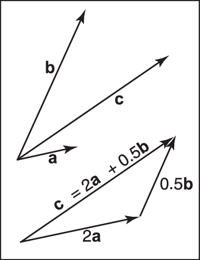
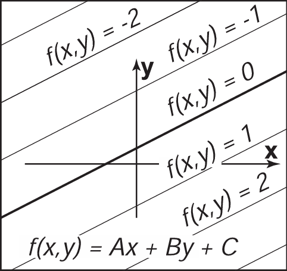

# 2.基础数学知识

图形学的大部分内容只是将数学公式直译成代码。数学公式越干净，写出的代码就越干净，所以本书的大部分内容都聚焦于“如何使用正确的数学公式完成工作”这个话题。本章回顾了高中和大学数学中的各种工具，旨在作为参考，而不是作为一个教程。本章可能看起来像是一个各种主题组成的大杂烩，事实上它也确实如此：每个主题之所以被选择是因为它在“标准”数学课程中的略微不寻常、因为它在图形学中具有核心地位、或者因为我们一般不从几何角处理它。除了对本书所使用的符号进行回顾外，本章还强调了标准本科课程中有时会跳过的几个要点，比如三角形的重心坐标。本章不会严肃探究这些知识，相反，我们会着重于直觉和几何解释。而对线性代数的讨论则被推迟到了第六章中我们学习矩阵变换之前。我们鼓励读者浏览本章以熟悉所涉及的主题，并在需要时参考本章。本章末尾的练习也许能帮助你确定哪些主题需要复习。

## <span data-type="text" style="color: var(--b3-font-color3);">2.1 集合和映射</span>

映射（mapping），也叫函数（function），是数学和编程的基础。像程序中的函数一样，数学中的映射接受某个类型（type）的参数，并将其映射到（返回）一个特定类型的对象。在程序中，我们说的是“类型”；在数学中，我们说的是“集合”。当一个对象是一个集合的成员时，我们使用 ∈ 符号。比如说，

$$
a\in S
$$

可以读作“ $a$ 是集合 $S$ 的成员”。给定任何两个集合 $A$ 和 $B $ ，我们可以通过取两个集合的笛卡尔积（cartesian product）来创建第三个集合，表示为 $A\times B$。这个集合 $A\times B$ 由所有可能的有序对 $(a,b)$ 组成，其中 $a\in B$ 且 $b\in B$。作为缩写，我们用符号 $A^2$表示 $A\times A$。我们可以扩展笛卡尔积，从三个集合中创建一个新集合，该集合包含所有可能的有序三元组，以此类推，从任意多的集合中创建任意长的有序元组。

常见的集合包括：

* $\mathbb{R}$——实数；
* $\mathbb{R^+}$——非负实数（包括0）；
* $\mathbb{R^2}$——真实二维平面中的有序对；
* $\mathbb{R^n}$——n维笛卡尔空间中的点；
* $\mathbb{Z}$——整数；
* $S^2$——单位球面上的三维点（R3 中的点）的集合。

请注意，虽然 $S^2$ 是由三维空间中的点组成的，但它也在一个可以用两个变量进行参数化的表面上，所以它可以被认为是一个二维集合。映射的记号使用箭头和冒号，例如：

$$
f:\mathbb{R}\mapsto \mathbb{Z},
$$

你可以把它理解为“有一个叫做 $f$ 的函数，它将一个实数作为输入，并将其映射成一个整数”。这里，箭头前面的集合被称为函数的定义域（domain），右边的集合被称为目标（target）。

> 译注：此处的目标（target）指的是陪域（codomain）。关于这点的详细讨论请参考https://math.stackexchange.com/questions/440235/range-of-function-vs-target-of-function 中的回答。

计算机程序员可能更愿意使用下面的等价表达：“有一个叫 $f$ 的函数，它有一个实数参数并返回一个整数”。换句话说，上面的集合映射符号等同于常见的编程符号：

$$
integer f(real) \leftarrow 等价 \rightarrow f:\mathbb{R} \mapsto \mathbb{Z}
$$

因此，“冒号-箭头”符号可以被认为是一种编程语法，就这么简单。

点 $f(a)$ 被称为 $a$ 的像（image），一个集合 $A$（定义域的子集）的像是目标的子集，目标包含 $A$ 中所有点的像。整个定义域的像被称为函数的值域（range）。

### <span data-type="text" style="color: var(--b3-font-color3);">2.1.1 逆映射</span>

如果我们有一个函数 $f:A\mapsto B$，那么可能存在一个反函数（inverse function）$f^{-1}:B\mapsto A$，这是通过 $f^{-1}(b)=a,b=f(a)$ 定义的。该定义只在所有 $b \in B$是函数 $f$ 下一些点的像（也就是说，值域和目标相等）且只有一个这样的点（也就是说，在 $f(a)=b$ 中，只有一个让等式成立的 $a$）的情况下有效。这种映射或函数称为双射（bijection）。双射将每一个 $a\in A$ 映射到唯一的 $b\in B$ ，对于每一个 $b\in B$ ，正好有一个 $a\in A$ ，使 $f(a)=b$ 

​​

**图 2.1**：一 个 双 射 $f$ 及其 反函数 $f^{-1}$。注 意，$f^{-1}$ 也 是 一个双 射。

例如，一组骑手和一组马匹之间的双射关系表明，每个人都骑着一匹马，每匹马都被骑着。这两个函数是骑手（马）和马（骑手），它们都是彼此的反函数。不是双射的函数没有反函数。

​​

**图 2.2**：函 数 $g$ 不具有反函 数，因为集合 $d$ 中的两个元素映射到了集合 $E$ 中的同一个元素。函数 $h$ 没有反函数，因为集合 $d$ 中没有元素映射到集合 $F$ 中的元素 $T$。

一个双射的例子是$f:\mathbb{R}\mapsto\mathbb{R},f(x)=x^3$。它的反函数为$f^{-1}(x) =3\sqrt{x}$。这个例子表明，标准的符号可能有些笨拙，因为 $x$ 在 $f$ 和 $f^{-1}$ 中都被用作虚拟变量（dummy variable）。有时使用不同的虚拟变量会更直观，比如写成 $y = f(x)$ 和 $x = f^{-1}(y)$ 的形式。这就有了更直观的 $y=x^3$ 和 $x=\sqrt[3]{y}$。一个没有反函数的例子是 $sqr:\mathbb{R}\mapsto\mathbb{R}, sqr(x) = x^2$。它没有反函数的原因有两个：首先：$x^2 = (−x)^2$，其次定义域中没有成员映射到目标的负数部分。请注意，如果我们把定义域和值域限制在 $\mathbb{R}^+$，还是可以定义一个反函数的。如此一来 $\sqrt{x}$ 就是一个有效的反函数。

### <span data-type="text" style="color: var(--b3-font-color3);">2.1.2 区间</span>

通常情况下，我们希望让一个函数处理的实数局限在某个范围内，实现这种约束的一个 方法就是规定一个区间（interval）。区间的一个例子是“0 和 1 之间的实数、不包括 0 或 1”，我 们把它表示为 $(0,1)$。因为它不包括其端点，所以被称为开区间。相对应的闭区间则包含其端 点，用方括号表示：$[0,1]$。这种符号可以混合使用；比如，$[0,1)$ 包括 0，但不包括 1。当写一 个区间 $[a,b]$ 时，我们假定 $a≤b$。表示一个区间的三种常见方法如**图2.3**所示。区间的笛卡尔积经常被使用。例如，为了表示点$x$在三维的单位立方体中，我们说$x\in[0,1]^3$。

​​

**图2.3**：三种等价的方式来表示 $a$ 到 $b$ 的左开右闭区间。

区间在与常常与集合运算结合在一起使用：交集（intersection）、并集（union）和差集 （difference）。例如，两个区间的交集是它们公共点的集合，符号 $\bigcap$ 用来表示交集。例如，$[3,5)\bigcap[4,6]=[4,5)$。而并集使用符号∪来表示两个区间中的点合并后产生的集合。例如，$[3,5)\bigcup[4,6]= [3, 6]$。差集运算符与前两个运算符不同，它根据参数顺序产生不同结果。减号用于差集运算， 它返回在左侧区间但不在右侧区间的点。例如，$[3,5)−[4,6]=[3,4]$，以及$[4,6]−[3,5]=[5,6]$。 这些操作用区间图就能很直观地表现出来。

​​

**图 2.4**：在 $[3, 5)$ 和 $[4,6]$ 上的区 间 操 作。

### <span data-type="text" style="color: var(--b3-font-color3);">2.1.3 对数函数</span>

尽管今天对数（logarithm）已不像使用计算器之前那么普遍了，但它在具有指数项的方程 问题中仍然很有用。根据定义，每个对数都有一个基数 $a$（$base$ $a$，也称“底”）。$x$ 的以 $a$ 为底 的对数通常被写作 $\log_{a}{x}$，并且它被定义为若要得到 $x$ 需要将 $a$ 乘幂的指数值。即：

$$
y =\log_{a}{x} \Leftrightarrow a^y=x.
$$

请注意，以a为底数的对数函数和以a为底数的幂函数是互逆的。这个基本定义可引申出几 个结论：

$$
a^{\log_{a}(x)} = x;\\ \log_{a}{(a^x)} = x;\\ \log_{a}{(xy)} = \log_{a}{x} + \log_{a}{y};\\ \log_{a}{(x/y)} = \log_{a}{x} − \log_{a}{y};\\ \log_{a}{x} = \log_{a}{b}\log_{b}{x}.
$$

当我们将微积分应用于对数时，经常会出现特殊数字$e=2.718...$。以$e$为底的对数被称为自然对数（naturallogarithm）。我们一般用简写 $ln$ 来表示：

$$
\ln_{x} ≡ \log_{e}{x}.
$$

“≡”符号的意思是“根据定义恒等”。像 $π$ 一样，特殊数字 $e$ 在很多情况下都会出现。除了 $e$ 以 外，在许多领域还使用特定的基数进行操作，并在其写法中省略基数，即 $\log{x}$ 的形式。例如， 天文学家经常使用以 10 为底的对数，理论计算机科学家经常使用以 2 为底的对数。由于计算机图形学借鉴了许多其他领域的技术，我们将避免这种缩写。对数的导数和指数的导数阐明了为什么自然对数是“自然的”：

$$
\frac{d}{dx} \log_{a}{x} = \frac{1}{x\ln_{a}};\\
\frac{d}{dx} a^x = a^x\ln_{}{a}.
$$

上面的常数乘数只有在 $a=e$ 时才等于 1。

## <span data-type="text" style="color: var(--b3-font-color3);">2.2 求解二次方程</span>

一个二次方程（quadraticequation）满足如下格式：

$$
Ax^2+Bx+C=0,
$$

其中 $x$ 是一个未知的实数，而 $A、B$ 和 $C$ 是已知的常数。如果你能联想到 $y=Ax^2+Bx+C$ 的二维 $xy$ 图，那么该二次方程的解就是函数 $y$ 与 $x$ 轴交点的横坐标值。因为 $y=Ax^2+Bx+C$ 是一条抛物线，根据抛物线是否未相交、相切或相交于 $x$ 轴，将有零个、一个或两个实数解。

​​

**图 2.5**：二次方程根的几何解释是抛物线与 $x$ 轴的 交点。

为了求解二次方程，我们先将方程除以 $A$：

$$
x^2 + \frac{B}{A} x + \frac{C}{A} =0.
$$

 然后，我们通过“构造平方项”的方式来合并项：

$$
(x+\frac{B}{2A})^2 − \frac{B^2}{4A^2} + \frac{C}{A} = 0.
$$

将常数部分移到等号右边，然后取平方根，得到：

$$
x + \frac{B}{2A} = \pm \sqrt{\frac{B^2}{4A^2} − \frac{C}{A}}.
$$

从两边减去 $\frac{B}{2A}$，然后用分母 $2A$ 合并分式，就得到了我们熟悉的形式：

$$
x = \frac{−B \pm \sqrt{B^2 − 4AC}} {2A}.
$$

此处的“$\pm$”符号意味着有两个解，一个是正号，一个是负号。因此，$3\pm1$ 等于 2 或 4。请注意，决定实数解数量的项是：

$$
D≡B^2−4AC,
$$

这被称为二次方程的判别式（discriminant）。如果 $D > 0$，有两个实数解（也叫根（root））；如果 $D=0$，有一个实数解（一个双根（a "double" root））；如果 $D<0$ 则没有实数解。

例如，$2x^2+6x+4=0$ 的根是 $x=−1$ 和 $x=−2$，方程 $x^2+x+1=0$ 没有实数解。这些方程的判别式分别是 $D=4$ 和 $D=−3$，且我们都按预期得到了解的数量。在程序中，我们通常先评估 $D$ 值，如果 $D$ 为负数，则直接返回无根（noroots）而不取平方根。

## <span data-type="text" style="color: var(--b3-font-color3);">2.3 三角函数</span>

在图形学中，我们在许多情况下都会用到基本三角函数。一般来说它平平无奇，但能记住基础定义往往是有帮助的。

### <span data-type="text" style="color: var(--b3-font-color3);">2.3.1 角</span>

尽管我们认为角的概念是理所当然的，但我们应重温其定义，以便我们将角的概念扩展到球体上。角是在两条射线（从一个原点出发的无限射线）或方向之间形成的，如图 2.6 所示，两条射线会形成两个角，我们还需要通过一些约定来决定使用哪个角。角（angle）是由射线在单位圆上切出的弧段的长度来定义的。一个常见的约定是使用较小的弧长，而角的符号由两条射线被指定的顺序决定。在该约定的约束下，所有角都在 $[−\pi, \pi]$ 范围内。

​​

**图 2.6**：两条射线将单位圆分为两个弧。任一弧的长度是两条射线之间的一个有效角度。我们要么使用较短的弧长作为角度，要么按照特定的顺序指定两条射线，且确定角度$\varphi$的弧是从第一条射线逆时针转到第二条射线的那部分弧。

这两个角中的任何一个都可以通过两条射线“切割”的单位圆的弧长来度量。因为单位圆的周长是 $2\pi$，所以两个可能的角总和为 $2\pi$，这种弧长的单位是弧度（radians）。另一个常见的单位是角度（degrees），圆的周角是 $360^{\circ}$。因此，一个弧度为 $\pi$ 的角的角度是 $180^{\circ}$，通常表示为 $180^{\circ}$。角度和弧度之间的转换是：

$$
\displaystyle
角度=\frac{180}{\pi}弧度；\\
$$

$$
弧度=\frac{\pi}{180}角度，
$$

### <span data-type="text" style="color: var(--b3-font-color3);">2.3.2 三角函数</span>

给出一个边长为 a、o、h 的直角三角形，其中 h 是最长边的长度（总是与直角相对），或者叫斜边（hypotenuse），勾股定理（Pythagorean theorem）描述了一种重要的关系：

$$
a^2 + o^2 = h^2.
$$

你可以从图 2.7 中看到这一点，大正方形的面积为 $(a + o)^2$，四个三角形的面积合计为 $2ao$，中心正方形的面积为 $h^2$。

​​

由于三角形和中心正方形均匀地细分了较大的正方形，所以我们可以很容易地取得如下公式：$2ao + h^2 = (a + o)^2$。通过直角三角形，我们可以定义角 $\phi$ 的 $\sin$ 值和 $\cos$ 值，以及其他基于比值的三角表达式：

$$
\sin{\phi} ≡\frac{o}{h};\\
$$

$$
\csc{\phi} ≡\frac{h}{o};
$$

$$
\cos{\phi} ≡\frac{a}{h};
$$

$$
\sec{\phi} ≡\frac{h}{a};
$$

$$
\tan{\phi} ≡\frac{o}{a};
$$

$$
\cot{\phi} ≡\frac{a}{o}.
$$

这些定义允许我们建立极坐标系（polar coordinates），其中任何一个点都被编码为其与原点的距离及其与 $x$ 轴正半轴的角（带符号），如 **图 2.8** 所示。

​​

**图 2.8**：点 $(x_a, y_a)=(1,\sqrt{3})$ 的极坐标 为 $(r_a,\phi_a)=(2,π/3)$。

请注意，角的范围是 $\phi \in (−\pi, \pi]$，且正数角是从 $x$ 轴正半轴逆时针方向旋转取得的。“将逆时针方向映射到一个正数”这个约定是主观性的，但它被应用于图形学很多场景中，因此值得一记。

三角函数是周期性的，可以接受任何角作为参数。例如，$\sin{A} = \sin{(A + 2π)}$。这意味着当我们考虑整个 $R$ 域时，这些函数是不可逆的。这个问题可以通过限制标准反函数的值域来避免。这在几乎所有现代数学库中都是以标准方式进行的（例如，Plauger（1991））。定义域和值域如下：

$$
a\sin : [−1, 1] \mapsto [-\frac{\pi}2,\frac{\pi}{2}];
$$

$$
a\cos : [−1, 1] \mapsto [0, \pi];
$$

$$
a\tan : \mathbb{R} \mapsto [−π2,π2];
$$

$$
a\tan 2 : \mathbb{R}^2 \mapsto [−π, π].
$$

最后一个函数 $a\tan 2(s, c)$ 往往很有用。它采用与 $sin {A}$ 成比例的值 $s$ 以及与 $\cos{A}$  成比例的值 $c$，两者具有相同的因子，最后返回值 $A$（假定因子为正数）。一种思考方式是它返回了二维笛卡尔点 $(c, s)$ 在极坐标中的角 **（图 2.9）** 。

​​

**图 2.9**：函 数$a\tan 2(s, c)$返回 A的角，这在图形学中往往很有用。

### <span data-type="text" style="color: var(--b3-font-color3);">2.3.3 有用的恒等式</span>

本节未经推导地列出了各种有用的三角恒等式。  
移位恒等式（shifting identities）：

$$
\sin{(−A)} = − \sin{A}
$$

$$
\cos{(−A)} = \cos{A}
$$

$$
\tan{(−A)} = − \tan{A}
$$

$$
\sin(\frac{\pi}{2}−A) = \cos{A}
$$

$$
\cos(\frac{\pi}{2}− A) = \sin{A}
$$

$$
\tan(\frac{\pi}{2}− A) = \cot{A}
$$

毕达哥拉斯恒等式（Pythagorean identities）：

$$
\sin^2{A} + \cos^2{A} = 1\\
\sec^2{A} − \tan^2{A} = 1\\
\csc^2{A} − \cot^2{A} = 1
$$

加减法恒等式（addition and subtraction identities）：

$$
\sin{(A + B)} = \sin {A} \cos {B} + \sin {B} \cos {A}\\
\sin{(A − B)} = \sin {A} \cos {B} − \sin {B} \cos {A}\\
\sin{(2A)} = 2 \sin {A} \cos {A}\\
\cos{(A + B)} = \cos {A} \cos {B} − \sin {A} \sin {B}\\
\cos{(A − B)} = \cos {A} \cos {B} + \sin {A} \sin {B}\\
\cos{(2A)} = \cos^2{A} − \sin^2{A}\\
$$

$$
\tan{(A + B)} = \frac{\tan {A} + \tan {B}} {1 − \tan{A} \tan{B}}
$$

$$
\tan{(A - B)} = \frac{\tan {A} - \tan {B}} {1 + \tan{A} \tan{B}}
$$

$$
\tan{(2A)} = \frac{2tan{A}} {1 - \tan^2{A}}
$$

半角恒等式（half-angle identities）：

$$
\sin^2{(\frac{A}{2})} = 1 − \cos{A^2}
$$

$$
\cos^2{(\frac{A}{2})} = 1 + \cos{A^2}
$$

乘法恒等式（product identities）：

$$
\sin{A} \sin{B} = -\frac{\cos{(A + B)} − \cos{(A − B)}}{2}
$$

$$
\sin {A} \cos {B} = \frac{\sin{(A + B)} + sin{(A − B)}}{2}
$$

$$
\cos {A} \cos {B} = \frac{\cos{(A + B)} + \cos{(A − B)}}{2}
$$

以下恒等式适用于边长为 $a$、$b$ 和 $c$ 的任意三角形，每边相对的角分别为 $A$、$B$、$C$​ **（图2.10）** ，

$$
\sin {A} a = \sin {B} b = \sin {C} c （正弦定理）
$$

$$
c^2 = a^2 + b^2 − 2ab \cos {C}（余弦定律）
$$

$$
\frac{a + b}{a − b} = \frac{\tan{\frac{A-B}{2}}}{\tan{\frac{A-B}{2}}}（正切定理）
$$

三角形的面积也可以根据这些边长计算：  

$$
三角形面积 = \frac{1}{4}\sqrt{p(a + b + c)(−a + b + c)(a − b + c)(a + b − c)}
$$

​​

**图2.10**：三角定律的几何示意图。

### <span data-type="text" style="color: var(--b3-font-color3);">2.3.4 立体角和球面三角学</span>

本节中的传统三角学涉及平面上的三角形。三角形也可以定义在非平面上，这在很多领域都会出现，比如天文学中就有定义在单位半径球体上的三角形。这些球面三角形（sphericaltriangles）的边是球面上的大圆（单位半径的圆）的线段。对这类三角形的研究是一个称为球面三角学（spherical trigonometry）的领域，其在图形学中一般并不常用，但当它出现时便不可忽视。我们不会在这里讨论它的细节，但希望读者知道当相关问题出现时存在这样一个研  
究领域，并且该领域有很多有用的规则，例如球面余弦定律和球面正弦定律。关于使用球面三角学机制的一个例子，请看一篇关于三角形光照采样（sampling triangle lights）（投影到一个球面三角形）的论文（Arvo，1995b）。

对计算机图形学而言，立体角（solid angles）的概念更加重要。角可以让我们量化一些东西，比如“在我的视野中这两根柱子的距离是多少”，而立体角则能让我们量化“那架飞机在我的视野中覆盖了多少面积”这样的问题。对于传统的角，我们把线段投射到单位圆上，并在单位圆上测量投射的两点之间的弧长。我们经常使用这个弧长作为角，以至于许多人都会忘记这个定义，因为在当下它对我们来说是如此直观。立体角也同样简单，但它们可能看起来更令人困惑，因为我们大多数人都是在成年后才了解它们的。对于立体角，我们把“看到”飞机的可见方向投射到单位球体上，并测量其面积。这个面积就是立体角，与“弧长就是角”的方式相同。角以弧度测量，总和为 $2\pi$（单位圆的总长度），而立体角则以立体弧度（steradians）测量，总和为 $4\pi$（单位球的总表面积）。

## <span data-type="text" style="color: var(--b3-font-color3);">2.4 向量</span>

向量（vector）同时描述了长度和方向，它总是用箭头表示。如果两个向量具有相同的长度和方向，则它们是相等的，即使在我们看来它们处于不同的位置 **（图 2.11）** 。

​​

**图 2.11**：这两个向量是相同的，因为他们拥有相同的长度和方向。

您应该尽可能地将向量视为箭头，而不是坐标或者数字。尽管有时在程序中我们不得不将向量表示为数字，但即使在代码中，他们也应该以对象的形式来操作，并且只有低级向量操作才能知道他们的数字表示（DeRose，1989）。向量用粗体字符表示，例如 $a$。向量的长度表示为 $\Vert a\Vert$。单位向量（unit vector）是长度为一的向量。零向量（zero vector）是零长度的向量，零向量的方向未定义。

向量可以用来表示许多不同的东西。例如，它们可用来存储偏移量（offset），或者叫位移（displacement）。如果我们知道“宝藏埋在秘密会议地点以东两步，以北三步”，那么我们就可以知道偏移量，但我们不知道起点在哪。向量也可以用来存储一个位置（location），或者说用来表达位置（position）或点（point）。一个位置可以表示为另一个位置的位移。通常我们有一个已知的原点位置，所有其他位置都存储为相对于它的偏移量。请注意，位置不是向量。正如我们将讨论的那样，您可以将两个向量相加。但将两个位置相加通常没有意义，除非它是计算某个位置加权平均值的中间操作（Goldman，1985 年）。将两个偏移量相加则确实有意义，所以这就是偏移量是向量的原因之一。这再次强调了位置本身不是偏移量，它是来自特定原点的偏移量，偏移量本身也不是位置。

### <span data-type="text" style="color: var(--b3-font-color3);">2.4.1 向量运算</span>

实数的算术运算向量基本也有。两个向量相等当且仅当它们具有相同的长度和方向。根据平行四边形法则（parallelogram rule）将两个向量相加。这条规则表明，两个向量的和是通过将任一向量的尾部放在另一个向量的头部来求得的 **（图 2.12）** 。

​​

**图2.12**：两个向量通过头尾相连来实现 相加，相加的顺序是任意的。

和向量是与两个向量共同“构成三角形”的向量。平行四边形是通过两个向量的任意求和顺序构成的。这表明向量加法具有可交换性：

$$
a + b = b + a.
$$

请注意，平行四边形法则只是形式化了我们对位移的直观感受。想象沿着一个向量从头走到尾，然后沿着另一个向量走。净位移只是平行四边形的对角线。您还可以为向量添加一元负号（unary minus）：$−a$​ **（图 2.13）** 是一个与 $a$ 长度相同但方向相反的向量。这样我们就能定义向量的减法：

$$
b − a ≡ −a + b.
$$

​​

**图2.13**：向 量 $−a$ 拥有与向量 $a$ 相同的长度但是方向相反。

您可以使用平行四边形法则可视化向量减法 **（图 2.14）** 。我们也可以将向量减法写成这种形式：

$$
a + (b − a) = b.
$$

​​

**图2.14**：向量减法只是第二个参数反转的矢量加法。

向量也可以相乘，事实上向量乘法不止一种。首先我们可以通过对向量乘以实数 $k$ 来缩放（scale）向量，这种乘法只改变向量的长度而不改变其方向。例如，$3.5a$ 是与 $a$ 方向相同的向量，但它的长度是 $a$ 的 3.5 倍。我们会在本节后面讨论涉及到两个向量的两种乘积，点乘（dot product）和叉乘（cross product），以及第 6 章中涉及到三个向量的乘积（行列式，determinant）。

### <span data-type="text" style="color: var(--b3-font-color3);">2.4.2 向量的笛卡尔坐标系</span>

一个二维向量可以由任意两个不平行的非零向量构造而来，这两个向量的性质叫做线性独立（linear independence）。两个线性独立的向量构成了一个二维基（或称“基底”，basis），相关向量也因此被称作基向量（basis vectors）。比如一个向量 $c$ 可以表示成两个基向量 $a$ 和 $b$ 的组合形式 **（图 2.15）** ：

$$
c = \text{a}_ca + \text{b}_cb.
$$

​​

**图2.15**：任意二维向量 $c$ 都是任意两个不平行二维向量 $a$ 和 $b$ 的加权和。

注意权重 $\text{a}_c$ 和 $\text{b}_c$ 是独一无二的。在这两个向量是正交（orthogonal）的情况下基特别有用（也就是说这两个向量构成了一个直角）；如果它们还是单位向量的话就更有用了，这时它们是标准正交的（orthonormal）。如果我们假设这样两个特殊的向量 $x$ 和 $y$ 是已知的，那我们就能用它们表示笛卡尔坐标系（Cartesian coordinate system）中的所有其他向量了，每个向量都可以用两个实数来表示。比如一个向量 $a$ 可以表示成：

$$
a = \text{x}_ax + \text{y}_ay,
$$

其中 $\text{x}_a$ 和 $\text{y}_a$ 是二维向量 $a$ 的实数笛卡尔坐标 **（图 2.16）** 。

​​

**图2.16**：向量的二维笛卡尔基。

注意这和前一个公式并没有什么本质区别，尽管前一个公式中的基向量不是标准正交的。而使用笛卡尔坐标系会有一些好处，例如，根据勾股定理，$a$ 的长度是：

$$
\Vert a \Vert = \sqrt{x_a^2 + y_a^2}
$$

在笛卡尔坐标系中计算点乘、叉乘、向量坐标也很简单，这点我们在接下来的章节里就会看到。按照惯例，我们在写向量 $a$ 的坐标时可以写成有序数对 $(x_a, y_a)$ 的形式，也可以写成列矩阵（column matrix）的形式：

$$
a = \left[ \begin{array}{c}
x_a \\ 
y_b
\end{array} \right].
$$

矩阵的形式取决于排版惯例，我们偶尔也会将其写成行矩阵（row matrix）的形式，这时我们会用 $a^T$ 的形式：

$$
a^T =
\left[
\begin{array}{cc}
x_a & y_a
\end{array}
\right].
$$

我们也可以用这种方法描述笛卡尔坐标系中三维或更高维的向量。对于三维向量，我们会额外使用一个同时与向量 $x$、向量 $y$ 正交的基向量 $z$。

### <span data-type="text" style="color: var(--b3-font-color3);">2.4.3 点乘</span>

点乘（dot product）是将两个向量相乘的最简单途径。向量 $a$ 和向量 $b$ 的点乘记为 $a \cdot b$，由于其返回的结果是个标量，它也因此被称为标量乘法（scalar product）。点乘返回的结果取决于两个向量的长度和它们之间的夹角 $\Phi$​ **（图 2.17）** ：

$$
a \cdot b = \Vert a \Vert \Vert b \Vert \cos{\Phi},
$$

在图形学程序中，点乘最常见的用途便是计算两向量间夹角的余弦值了。

​​

**图2.17**：点乘与长度和角相关，它是图形学中最重要的公式之一。

除此以外点乘还可以计算一个向量在另一个向量上的投影值。向量 $a$ 在向量 $b$ 上的投影 $a \rightarrow b$ 是以直角投射上去的 **（图 2.18）** ：

$$
a \rightarrow b = \Vert a \Vert \cos{\Phi} =
\frac{a \cdot b} {\Vert b \Vert} ,
$$

​​

**图2.18**：向 量 a 在向量 b 上的投影是根据上述公式推导出来的。

点乘也遵循实数计算中常见的结合律和分配律：

$$
a \cdot b = b \cdot a,\\
a \cdot (b + c) = a \cdot b + a \cdot c,\\
(ka) \cdot b = a \cdot (kb) = ka \cdot b.
$$

如果二维向量 $a$ 和 $b$ 以笛卡尔坐标的形式表示，我们可以利用 $x \cdot x = y \cdot y = 1$ 和 $x \cdot y = 0$ 这两个公式来推导出如下点乘公式：

$$
a · b = (\text{x}_ax + \text{y}_ay) \cdot (\text{x}_bx + \text{y}_by)\\
= \text{x}_a\text{x}_b(x \cdot x) + \text{x}_a\text{y}_b(x \cdot y) + \text{x}_b\text{y}_a(y \cdot x) + \text{y}_a\text{y}_b(y \cdot y)\\
= \text{x}_a\text{x}_b + \text{y}_a\text{y}_b.
$$

同理对于三维向量可得：

$$
a \cdot b = \text{x}_a\text{x}_b + \text{y}_a\text{y}_b + \text{z}_a\text{z}_b.
$$

### <span data-type="text" style="color: var(--b3-font-color3);">2.4.4 叉乘</span>

叉乘 $a \times b$ 往往只用于三维向量，本章末尾笔记中的参考文献对广义叉乘（generalized cross products）进行了讨论。叉乘返回一个与其两个乘数垂直的三维向量，结果向量的长度与$\sin {\Phi}$. 相关：

$$
\Vert a \Vert \times \Vert b \Vert = \Vert a \Vert \Vert b \Vert \sin {\Phi}.
$$

$\Vert a \times b \Vert$ 的数值等于向量 $a$ 和向量 $b$ 构成的平行四边形的面积大小。此外，$a \times b$ 同时与向量 $a$ 和向量 $b$ 垂直 **（图 2.19）** 。

​​

**图 2.19**：叉 乘 $a \times b$的结果是一个同时与向量 $a$ 和向量 $b$ 垂直的三维向量，且 $a \times b$ 的长度等于上图所示平行四边形的面积。

注意这样一个向量有两种可能的方向。根据定义，$x−$ 轴、$y−$ 轴、$z−$ 轴的方向向量被定义为：

$$
x = (1, 0, 0),\\
y = (0, 1, 0),\\
z = (0, 0, 1),
$$

然后我们约定如下：$x \times y$ 的方向必须在 $z−$ 轴正半轴方向或负半轴方向。具体方向选择是随意的，但如下公式是确定的：

$$
z = x \times y.
$$

三个笛卡尔单位向量的所有可能的排列如下所示：

$$
x \times y = +z,\\
y \times x = −z,\\
y \times z = +x,\\
z \times y = −x,\\
z \times x = +y,\\
x \times z = −y.
$$

由于 $\sin {\Phi}$ 的特性，我们也可以知道一个向量自身的叉乘是零向量，例如：$x \times x = 0$。注意叉乘不满足交换律，也就是说 $x \times y \neq y \times x$。细心的读者可能会发现以上讨论无法让我们清晰描绘出三个笛卡尔轴之间的关系。更确切地说，如果我们把 $x$ 轴和 $y$ 轴放在人行道上并让 $x$ 轴指向东边、$y$ 轴指向北边，那么 $z$ 轴会指向天空还是地面呢？一般我们会使用名为“右手坐标系”的系统，其名称来源于以右手为参考的记忆体系：用右手手掌和手指“抓住”$x$ 轴、然后朝 $y$ 轴的方向旋转，向量 $z$ 应该会沿着大拇指方向（如 **图 2.20** 所示）。

> 译注：这几句话原文如下：“This name comes from the memory scheme of ”grabbing” x with your right palm and fingersand rotating it toward y. The vector z should align with your thumb.”。此处表达非常晦涩难懂且图片完全无法展示右手动作，建议此处按照国内老师对于右手坐标系的讲解进行学习，或参考维基百科（笛卡尔坐标系 # 三维空间）上的图片。

​​

**图2.20**：叉乘的“右手定则”。试想一下将右掌根放在向量 **a** 和向量 **b** 的尾部交叉处、然后将向量 **a** 的箭头推向向量 **b**，你右手拇指所指方向就是 $a \times b$ 的方向。

叉乘遵循结合律和分配律：

$$
a \times (b + c) = a \times b + a \times c,\\
a \times (kb) = k(a \times b).
$$

但根据“右手定则”，叉乘不满足交换律：

$$
a \times b = −(b \times a).
$$

如果用笛卡尔坐标表示向量，我们可以用一个清晰明确的展开式来计算叉乘：

$$
a \times b = (\text{x}_ax + \text{y}_ay + \text{z}_az) \times (\text{x}_bx + \text{y}_by + \text{z}_bz)\\
= \text{x}_a\text{x}_bx \times x + \text{x}_a\text{y}_bx \times y + \text{x}_a\text{z}_bx \times z \\+ \text{y}_a\text{x}_by \times x + \text{y}_a\text{y}_by \times y + \text{y}_a\text{z}_by \times z\\ + \text{z}_a\text{x}_bz \times x + \text{z}_a\text{y}_bz \times y + \text{z}_a\text{z}_bz \times z\\
= (\text{y}_a\text{z}_b − \text{z}_a\text{y}_b)x + (\text{z}_a\text{x}_b − \text{x}_a\text{z}_b)y + (\text{x}_a\text{y}_b − \text{y}_a\text{x}_b)z.
$$

‍

进一步可得坐标公式如下：

$$
a \times b = (\text{y}_a\text{z}_b − \text{z}_a\text{y}_b, \text{z}_a\text{x}_b − \text{x}_a\text{z}_b, \text{x}_a\text{y}_b − \text{y}_a\text{x}_b).
$$

### <span data-type="text" style="color: var(--b3-font-color3);">2.4.5 标准正交基和坐标框架</span>

管理坐标系是几乎所有图形程序的核心任务之一，这项任务的关键是管理标准正交基（orthonormal bases）。任意两个正交（互相垂直）且长度均为单位 1 的二维向量 $u$ 和 $v$ 的集合都能构成一个标准正交基，也就是说：

$$
\Vert u \Vert = \Vert v \Vert = 1,\\
u \cdot v = 0.
$$

在三维空间中，满足以下两个条件的三个向量 $u$、$v$、$w$ 共同构成标准正交基：

$$
\Vert u \Vert = \Vert v \Vert = \Vert w \Vert = 1,\\
u \cdot v = v \cdot w = w \cdot u = 0.
$$

如果以下公式成立，则该标准正交基是右旋的（right-handed）, 否则是左旋的（left-handed）：

$$
w = u \cdot v,
$$

注意笛卡尔规范标准正交基（Cartesian canonical orthonormal basis）只是无数可能标准正交基中的一种，真正让它与众不同的是它和它的隐式原点位置在程序中用作底层表示。因此，向量 $x$、$y$、$z$ 从不显式存储，也不会规定规范原点位置 $o$。全局模型往往存储在这个规范坐标系中，它也因此常被称为全局坐标系（global coordinate system）。但如果我们想使用另一个使用原点 $p$ 和正交基 $u$、$v$、$w$ 的坐标系就必须显式存储这些向量。这样一个坐标系被称为参考系（frame of reference）或坐标系（coordinate frame）。比如在一个飞行模拟器中，我们可能想要储存一个原点在飞机机鼻处、标准正交基与飞机方向一致的坐标系；同时我们还需要一个主要的规范坐标系 **（图 2.21）** 。和一个特定物体（比如飞机）绑定的坐标系，往往被称为局部坐标系（local coordinate system）。

底层上，局部坐标系是以规范坐标形式存储的。例如，如果 $u$ 有坐标$(x_u,y_u,z_u)$,

$$
u = \text{x}_ux + \text{y}_uy + \text{z}_uz.
$$

位置隐式包含与标准原点的偏移：

$$
p = o + \text{x}_px + \text{y}_py + \text{z}_pz,
$$

其中$(x_p, y_p, z_p)$是 $p$ 点的坐标。

注意，如果我们存储一个关于 $u-v-w$ 坐标系的向量 $a$，我们实际上是存储一个三元组$(u_a，v_a，w_a)$，其几何解释为：

$$
a = \text{u}_au + \text{v}_av + \text{w}_aw.
$$

要获得存储在$u-v-w$坐标系中的向量$a$的标准坐标，只需记得 $u$、$v$ 和 $w$ 本身是以笛卡尔坐标存储的，因此表达式$u_au+v_av+w_aw$已经是笛卡尔坐标。为了获得存储在标准坐标系中的向量 $b$ 的 $u-v-w$坐标，我们可以使用点积：

$$
\text{u}_b = u \cdot b;
\text{v}_b = v \cdot b;
\text{w}_b = w \cdot b.
$$

​​

**图2.21**

这是因为我们知道对于一些$u_b$ 、$v_b$和$w_b$  

$$
\text{u}_bu + \text{v}_bv + \text{w}_bw = b,
$$

点积分解$u_b$坐标：

$$
u \cdot b = \text{u}_b(u \cdot u) + \text{v}_b(u \cdot v) + \text{w}_b(u \cdot w)\\
= \text{u}_b.
$$

之所以如此，这是因为 $u$、$v$ 和 $w$ 是正交的。

第7.2.1节和第7.5节将讨论使用矩阵实现坐标系的变化。

### <span data-type="text" style="color: var(--b3-font-color3);">2.4.6 从单个向量构造基</span>

通常我们需要一个与给定向量对齐的正交基。也就是说，给定一个向量 $a$，我们需要一组正交的 $u$，$v$ 和 $w$，使得 $w$ 指向 $a$ 的同一方向（Hughes&Moller，1999），但我们并不特别关心 $u$ 和 $v$ 是什么。一个向量不足以确定唯一的答案；我们需要一个强大的方法，可以找到任何一个可能的基。

这可以像下面这样使用叉积来完成。首先使 $w$ 成为 $a$ 方向上的单位向量：

$$
w = \frac{a}{\Vert a \Vert}.
$$

然后选择任意一个与 $w$ 不共线的向量 $t$，并使用叉积构建垂直于 $w$ 的单位向量 $u$：

$$
u=\frac{t\times w}{||t\times w||}.
$$

 如果 $t$ 与 $w$ 共线，分母将消失，如果它们几乎共线，结果的精度将很低。找到与 $w$ 完全不同的向量的一个简单步骤是，从 $t$ 等于 $w$ 开始，并将 $t$ 的最小幅值分量改为 1。例如，如果$w=(1/\sqrt{2},-1/\sqrt{2},0)$，那么$t=(1/\sqrt{2},-1/\sqrt{2},1)$。一旦w和u被确定了，完成这组基就很简单了：  

$$
v = w \times u.
$$

使用此形式的情形的一个示例是曲面投影，其中需要与曲面法线对齐的基，但围绕法线的旋转通常不重要。

> 这样的方法当然可以用来构建任意顺序的三个向量，只是需要注意点乘的顺序确保基符合右手法则。

对于正式的生产代码，皮克斯的研究人员最近开发了一种从两个向量构建新向量的方法，这种方法以其紧凑性和高效性而令人印象深刻（Duff等人，2017）。他们提供了经过实战考验的代码，并鼓励读者使用，因为在整个行业中使用时并未出现任何“错误”。

### <span data-type="text" style="color: var(--b3-font-color3);">2.4.7 从两个向量构造基</span>

当基围绕给定向量旋转比较重要时，上一节中的程序也可用。一个常见的例子是为摄影机建立基：让一个向量与摄影机的观察方向对齐很重要，但摄影机围绕该向量的方向不是任意的，需要以某种方式指定。一旦固定了方向，就完全确定了基。

完全指定坐标系的常用方法是通过提供两个向量 $a$（指定 $w$）和 $b$（指定 $v$）。如果已知两个向量垂直，则通过 $u=b\times a$ 构造第三个向量就很简单了。

> $u =a\times b$ 也产生了一个标准正交基，但它是一个左手系。

为了确保，即使输入向量不完全是正交的，生成的基也是正交的，建议使用与单向量过程类似的过程：

‍

$$
w=\frac{a}{||a||}
$$

$$
u=\frac{b\times w}{||b\times w||}
$$

$$
v=w\times u
$$

> 如果你想让我将向量 $w$和 $v$ 设置为两个非垂直的方向，那么必须有所妥协——按照这个方案，我会按你的要求设置所有的东西，但是我只会对 $v$ 做最小的改动，使其实际上与向量 $w$ 垂直。

事实上，当 $a$ 和 $b$ 不垂直时，这个方法也能很好的奏效。在这种情况下，$w$ 将精确地沿 $a$ 的方向构造，并且 $v$ 被选择为垂直于 $w$ 的所有向量中与 $b$最近的向量。

如果 $a$ 和 $b$ 是共线的，此过程将不起作用。在这种情况下，$b$对于选择垂直于a的方向是没有帮助：因为它垂直于所有可能的方向。

在指定摄像机位置的示例（第4.3节）中，我们希望构造一个坐标系，该坐标系的 $w$ 与摄像机的观察方向平行，$v$ 应指向摄像机的顶部。为了使相机垂直定向，我们围绕视图方向建立基，使用垂直向上方向作为参考向量来确定相机围绕视图方向的朝向。将 $v$ 设置为尽可能接近垂直，与“将相机保持垂直”的直观概念完全匹配。

### <span data-type="text" style="color: var(--b3-font-color3);">2.4.8</span> <span data-type="text" style="color: var(--b3-font-color3);">正交化基</span>

有时，您可能会在计算种发现一些问题，这些问题是由假定为正交的基引起的，但由于计算中的舍入误差，或由于基存储在文件中的精度较低，因此出现了错误。

这时我们可以使用上一节的程序；简单地使用现有的 $w$ 和 $v$ 向量重新构造产生一个新的正交基，并且与旧的基接近。

这种方法适用于许多应用程序，但不是最好的。它确实产生精确的正交向量，并且对于几乎正交的原始基，结果不会偏离起始点太远。然而，它是不对称的：它“偏爱”$w$ 胜过 $v$，“偏爱”$v$ 胜过 $u$（其起始值被丢弃）。它选择一个接近原始基的基，但不能保证选择的是最接近的正交基。当这不能够满足需求时，可以使用SVD（第5.4.1节）计算正交基，该正交基保证最接近原始基。

## <span data-type="text" style="color: var(--b3-font-color3);">2.5 积分</span>

关于图形的一个可能的误解是它充满了积分，因此有人可能会认为必须擅长用代数方法求解积分。但事实绝对不是这样。图形中的大部分积分都无法解析求解的，因此可以用数值方法求解。很有可能你在图形学方面很有成就，却从未用代数方法解决过一个单一的积分。

虽然你不需要会用代数方法求解积分，但你需要会读懂它们，这样你就可以用数值方法求解它们。在一维中，积分通常很容易读懂。例如，这个积分

$$
\int_{\pi}^{2\pi} \sin{x} dx
$$

可以理解为“计算函数 $\sin{x}$ 在 $x= π$ 和 $x= 2\pi$ 之间的面积。”计算机科学家可以将：

$$
\int_{\pi}^{2\pi}dx
$$

作为一个函数调用。我们可以称之为“intergrate()”。它接受两个对象：函数和域（间隔）。所以调用可能是

```
float area = integrate(sin(), [pi, 2pi]).
```

在更高级的微积分中，我们可能会开始在球面上求积分，图形的简洁之处在于我们仍然可以这样想：

```
float area = integrate(cos(), [pi, 2pi])
```

上面两个函数内部的机制可能是不同的，但所有的积分都有两个性质：

1. 被积分的函数
2. 积分的域

通常情况下，诀窍就是仔细解出对于问题，1和2分别是什么。这非常类似于从烦人的文档中搞清楚 API 的正确调用。

### <span data-type="text" style="color: var(--b3-font-color3);">2.5.1 平均值和加权平均值</span>

积分计算的是总和。例如长度、面积、体积等。但是经常被用来计算平均数。例如，我们可以通过对一个地区(如一个国家)的高度积分来计算一个地区的总体积：

```
float volume = integrate(elevation(), country)
```

我们也可以计算平均海拔：

```
float averageElevation = integrate(elevation(), country) / integrate(1, country)
```

这基本上就是“体积除以面积”，可抽象为：

```
 float averageElevation = average(elevation, country)
```

我们也可以取 **加权平均**。即添加一个加权函数来强调平均值中的某些点。例如，如果我们想通过温度来强调区域的某一部分(这是非常随意的，我们将在下一节中看到更多相关的图形示例)：

```
 float weightedAverageElevation =
 integrate(temperature()*elevation(),country) / integrate(temperature(), country)
```

留意这种形式是一个好主意，通常积分包含一个未明确指出的加权平均，这有时可以帮助我们理解。

### <span data-type="text" style="color: var(--b3-font-color3);">2.5.2 对立体角进行积分</span>

我们经常看到的积分类型的一个例子是以下形式之一或其他相关的形式：

```
float shade = integrate(cos()*f*(), unit-hemisphere)
```

注意，由于 integrate(cos(), unit-hemisphere) \= pi ，加权平均版本只是

```
float shade = integrate((1/pi)*cos()*f*(), unit-hemisphere)
```

这个积分更传统的形式是

$$
S=\int_{v\in H}\frac{1}{\pi}(v\cdot n)f(v)(v\cdot n)d\sigma(v)
$$

或者用球坐标，就像我们用代数方法解这样的积分：

$$
S=\int_{\phi=0}^{2\pi}\int_{\theta=0}^{\pi}\frac{1}{\pi}(v\cdot n)f(\theta,\phi)\cos\theta sin\theta d\theta d\phi
$$

正弦项是球坐标的面积修正因子。在图形学中，我们很少需要把这些都写出来，而是在数值求解积分时使用更简单的形式。

上面的特殊积分是一个完全反射的哑光（漫反射）表面的阴影，它也是所有入射颜色的加权平均值。这种结构对直觉很有帮助;表面的颜色通常与入射颜色的加权平均值有关。

对立体角的积分几乎总是相同的但是使用了各种各样的符号。关键是要认识到这只是符号，并将你看到的符号映射到你最舒服的一个。这很像阅读伪代码!

---

## <span data-type="text" style="color: var(--b3-font-color3);">2.6 密度函数</span>

密度函数在图形学中一定会出现（例如，“概率密度函数”），它们会令人很困惑，但掌握它们的确切含义将帮助我们使用它们，并在它们出现时摆脱困惑。我们知道什么是函数，密度函数就是一个返回密度的函数。那么密度是什么?密度是一种“某单位内有多少东西”，更正式地说是一种密集量。例如，你的重量不是密度，它是一个广泛性的量，只是一个东西的数量，而不是每单位含有某东西的数量。一个人在一段时间内可能增加的体重，比如一年，是一个用公斤来衡量的东西的数量，是一个粗放的数量，而不是密度。一个人“每天”或“每小时”增加的重量是一个密集量，应此它是密度。

作为一个非密度函数的例子，考虑太阳能电池板在某一天（2014年7月1日）产生的能量，我们设它是120千焦耳。这是一堆“东西”。这很好，但这足够运行我的电脑吗?我的电脑，如果是台式电脑，需要一定的能量密度或能量速率来保持工作。那么我们如何将这一天的能量转化成能量的速率呢?我们可以把它分成几段时间。例如，我们可以做4小时、2小时或1小时的区块，我们会看到白天的速率在变化，但数量也在不断减少，如 **图2.22** 所示。

​​

**图2.22** 随着在固定时间间隔内产生的能量的图形下降，时间间隔变小，柱子的高度也随之下降（在宽度趋近于零的极限情况，盒子的高度为零）。

随着我们把时间划分得越来越细，我们最终会细化到分钟和秒，我们会得到更多关于时间变化的信息，但柱子的高度会变得非常小，以至于我们看不到任何东西。所以我们可以根据它们的宽度重新调整它们柱子的高度，使得$(30kJ)/(0.5 h) = 60kJ/h$。如果我们使用这个新的“每小时千焦”去度量，柱子就不会变短，如 **图2.23** 所示。如果我们把这个过程进行到极限当柱子的宽度变得无穷小，我们得到一条光滑的曲线。

​​

**图2.23** 如果我们将能量除以柱子的宽度，随着我们进一步细分，结果会变得更加精确。

这条曲线是密度函数的一个例子。它被一些人称为“能量密度”函数，其中密度所占的维度是时间，而一些情况被称为“时间能量密度”函数。因为这个特殊的密度非常有用，而且经常被谈论，所以它有了自己的名字———功率，我们不说焦耳每小时，而说瓦。注意，按照惯例，瓦是焦耳每秒而不是每小时;选择特定的单位是为了方便。例如，一些物理单位用米更有意义，一些用公里更有意义，一些用纳米更有意义（还有一些像光谱辐亮度这样的物理单位用米和纳米来表示相同的量，所以当你发现自己困惑时，这不是你的错）。

把这些放在一起，（1）密度总是某种比例，当你说“每单位 $Y$ 有这么多 $X$ ”或“每 $Y$ 有这么多 $X$ ”，比如“每小时有多少公里”(说“每单位长度有多少公里”会很奇怪，但如果每个人都认同长度单位是什么，那就很正常)，（2）密度函数是一个返回密度的函数。

密度函数本身对于比较两个不同点的相对浓度很有用。例如，对于随时间定义的能量密度函数（功率），我们可以说“下午2点的功率是上午9点的两倍”。另一种使用方法是计算一个区域的总量。例如，要计算下午2点到4点之间产生了多少能量，我们只需积分：

$$
E = \int_{2pm}^{4pm}P(t)dt
$$

多积分都是这样的,“对密度函数积分”,但表达不是很清晰。有时，如果你弄明白一个积分是否是在处理某个区间（区域）内密度函数的“质量”，事情就会更清楚。

---

## <span data-type="text" style="color: var(--b3-font-color3);">2.7 曲线和曲面</span>

曲线（尤其是曲面）在几何图形中起着核心作用，这里我们将回顾二维和三维空间中曲线和曲面的基础知识。

### <span data-type="text" style="color: var(--b3-font-color3);">2.7.1 二维隐式曲线</span>

直白地说，曲线是一组无需提起笔在纸上一下画完的点的集合。描述曲线的常用方法是使用隐式方程。二维隐式方程的形式为：

$$
f(x,y)=0.
$$

函数$f(x,y)$返回一个实值。使该值为零的点 $(x,y)$ 位于曲线上，而使该值为非零的点就不在曲线上。例如，假设 $f (x,y)$ 是

$$
f(x, y)=(x − x_c)^2 + (y − y_c)^2 − r^2 \tag{2.9}
$$

其中$(x_c,y_c)$是一个2D点，r是一个非零实数。如果我们取 $f(x,y)=0$，则能够使此等式成立的点，就位于，圆心为$(x_c,y_c)$ 且半径为 $r$ 的圆上。之所以称之为“隐式”方程，是因为曲线上的点 $(x,y)$ 不能立即从方程中计算出来，而必须通过解方程来确定。因此，曲线上的点不是由方程显式生成的，而是隐含在方程中的某个地方。

有趣的是，$f$ 确实包含所有 $(x,y)$ 的值。我们可以将 $f$ 视为一个地形，海平面为 $f=0$（**图2.24**）。

​​

**图2.24** 一个隐式函数 $f(x, y) = 0$ 可以被看作是一个高度场，其中 $f$ 表示高度（上图）。高度为零的路径就是隐式曲线（下图）。

海岸线就是隐式曲线。$f$ 的值是高度。另外需要注意的是，曲线将空间划分为 $f>0$、$f<0$ 和 $f=0$ 的区域。所以你可以通过计算 $f$ 来确定一个点是否在曲线的“内部”。注意，$f(x,y)=c$ 是关于任意常数 $c$ 的曲线，$c=0$ 仅仅是习惯。例如，如果$f（x,y）=x^2+y^2−1$，不同的 $c$ 给出的是以坐标原点为中心的各种半径的圆（**图2.25**）。

​​

**图2.25** 一个隐式函数定义了一条对于任何常数值的曲线，而零通常是惯用的选择。

我们可以用向量来简化公式。如果我们有 $c=(x_c,y_c)$ 和 $p=(x,y)$，那么我们的圆心为 $c$，半径为 $r$ 的圆应满足：

$$
(p − c) \cdot (p − c) − r^2 = 0
$$

这个方程，如果用代数展开，将得到方程  **(2.9)** ，但如果通过几何来“理解”方程，就更容易看出这是一个圆的方程。它可以这么理解，圆上的点 $p$ 具有以下特性：当从 $c$ 指向 $p$ 的向量与自身点乘时，值为 $r^2$。 因为一个向量与自身点乘时，结果就是它自身长度的平方，我们也可以将方程解读为 圆上的点 $p$ 具有以下性质：从 $c$ 指向 $p$ 的向量具有平方长度 $r^2$。  更好的是，我们观察到，向量长度的平方只是从 $c$ 到 $p$ 的距离的平方，这表明了等效形式：

$$
\Vert p - c\Vert ^2-r^2=0
$$

当然，这也意味着

$$
\Vert p-c\Vert - r=0
$$

上述内容可以理解为“圆上的点 $p$ 距离中心点 $c$ 的距离为 $r$ ”，这和其他圆的定义是一样的。这说明方程的向量形式通常比x和y的等效完全的笛卡尔形式更能体现几何性和直观性。因此，在可能的情况下，通常建议使用向量形式。此外，您可以在代码中支持向量类；使用向量形式时，代码会更清晰明了。面向向量的表达式在执行时也不太容易出错：一旦在你的代码中执行和调试向量类型，涉及 $x$、$y$ 和 $z$的剪切和粘贴错误就会消失。要适应这些方程中的向量需要一点时间，但一旦你掌握了窍门，回报会很大。

### <span data-type="text" style="color: var(--b3-font-color3);">2.7.2 二维梯度</span>

如果我们将函数 $f(x,y)$ 视为高度为 $f(x,y)$ 的高度场，则梯度向量所指的方向就是爬升最快的方向。梯度向量$\nabla f(x,y)$由下式给出：

$$
\nabla f(x,y)=(\frac{\partial f}{\partial x},\frac{\partial f}{\partial y}) .
$$

 隐式曲线  $f(x,y)$\= 0 上某一点处的梯度向量与该点处曲线的切线向量垂直。这种垂直的向量通常称为曲线的法向量。此外，由于梯度是指向爬升方向的，这就隐含了 $f(x，y)>0$ 的区域的方向。

在高度场中，偏导数和梯度的几何意义比通常更为好理解。假设在点 $(a,b)$ 附近，$f(x,y)$是一个平面（**图2.26**）。

​​

**图2.26** 一个表面的高度  $f(x, y)$ 在点 $(x, y) = (a, b)$ 附近是局部平面的。梯度是向上方向在这个高度为0平面上的投影。

现有一个特定的上坡和下坡方向。与该方向成直角的方向与平面水平。平面和 $f(x,y)=0$ 平面之间的任何交点都将位于水平方向。因此，上坡或下坡方向将垂直于相交线 $f(x,y)=0$。要了解偏导数为什么与此有关，我们需要将其几何意义直观的展现出来。回想一下，一维函数 $y=g(x)$ 的常规导数是：

$$
\frac{d y}{d x} \equiv \lim _{\Delta x \rightarrow 0} \frac{\Delta y}{\Delta x}=\lim _{\Delta x \rightarrow 0}  \frac{g(x+\Delta x)-g(x)}{\Delta x} \tag{2.10}
$$

这是g曲线切线的斜率。（**图2.27**）

​​

**图2.27** 一维函数的导数衡量的是与曲线相切的直线的斜率。

偏导数是一维导数的推广。对于二维函数 $f(x,y)$，我们不能像方程（2.10）那样对 $x$ 取相同的极限，因为对于给定的x的变化，f可以有多种方式的变化。然而，如果我们保持y为常数，我们就可以定义一个类似的导数，称为偏导数（**图2.28**）：

$$
\frac{\partial f}{\partial x} \equiv \lim_{\Delta x \rightarrow 0} \frac{f(x+\Delta x, y)-f(x, y)}{\Delta x}
$$

​​

**图2.28** 函数 $f$ 关于 $x$ 的偏导数必须在 $y$ 保持不变的情况下才有唯一值，如图中所示的黑点所表示。空心点则显示了 $y$ 不保持不变时 $f$ 的其他值。

为什么关于 $x$ 和 $y$ 的偏导数是梯度向量的分量？同样，几何比代数更具有直观性。在**图2.29**中，我们看到向量a沿着f上固定的路径移动。请注意，这也是在一个足够小的尺寸下，表面高度 $(x,y)=f(x,y)$ 可以被视为局部平面。从图中，我们可以看到向量 $a=(\Delta x,\Delta y)$。

 因为爬升方向垂直于向量a，我们知道相互垂直的两个向量的点积等于零：

$$
(\nabla f) \cdot a ≡ (x_\nabla, y_\nabla) \cdot (x_a, y_a) = x_\nabla \Delta x + y_\nabla \Delta y = 0. \tag {2.11}
$$

我们也知道在 $(x_a,y_a)$ 方向上 $f$ 变化等于零：

$$
\Delta f=\frac{\partial f }{\partial x}\triangle x+\frac{\partial f }{\partial y}\triangle y \equiv \frac{\partial f }{\partial x}x_a + \frac{\partial f }{\partial y}
$$

给定任何两个相互垂直的向量 $(x,y)$ 和 $(x ',y ')$ ，我们知道它们之间的角度是 90 度，因此它们的点积等于零（回想一下，点积的结果与两个向量之间的角度的余弦成正比）。因此，我们有 $xx '+yy '=0$。给定 $(x,y)$，很容易构造出对应的向量，其与 $(x,y)$ 的点积等于零，最明显的两个例子就是 $(y,−x)$ 及 $(−y,x）$；您可以验证一下，这些向量是否满足与 $(x,y)$ 的点积为零。对这一结果进行推广，$(x,y)$ 垂直于 $k(y,−x)$，其中k是任意的非零常数。这意味着：

$$
(x_a,y_a)=k(\frac{\partial f}{\partial y},-\frac{\partial f}{\partial x}). \tag{2.12}
$$

结合等式（2.11）和（2.12）得出：

$$
(x{\nabla},y{\nabla})=k'(\frac{\partial f}{\partial x},\frac{\partial f}{\partial y}) ,
$$

其中 $k'$ 是任意非零常数。根据定义，“上坡”意味着 $f$ 的正变化，所以我们希望 $k '>0，k '=1$ 是一个非常好的约定。

作为梯度的一个例子，考虑隐式圆 $x^2+y^2− 1=0$，梯度向量 $(2x,2y)$，表示圆的外侧是函数 $f（x,y）=x^2+y^2-1$ 的正区域。请注意，根据隐式方程中的乘数，梯度向量的长度可能会有所不同。例如，单位圆可以被表示为$Ax^2+Ay^2-A=0$，其中A为任意非零数。该曲线的梯度为 $(2Ax,2Ay)$。梯度将会与圆垂直，但其长度由 $A$ 确定。如果 $A>0$，法线将指向圆的外侧，如果 $A<0$，法线将指向圆的内侧。这个从外向内的开关是应该的，因为正区域在圆内切换。就高度场视图而言，$h=Ax^2+Ay^2− A$， 圆是在零高度上。对于 $A>0$，圆包围的区域会凹陷；对于 $A<0$，圆包围的区域会凸起。随着 $A$ 变得更负，凹凸的高度也随之增加，但 $h=0$ 圆不会改变。爬升最快的方向不变，但坡度增加。梯度的长度反映了坡度的这种变化。所以直观地说，你可以认为梯度的方向是指向上坡的，它的大小是度量坡的陡峭程度。

#### <span data-type="text" style="color: var(--b3-font-color3);">隐式二维线</span>

我们所熟悉的，直线的“斜率截距”式是：

$$
y = mx + b.\tag{2.13}
$$

 这可以很容易地转换为隐式形式（**图2.30**）：

$$
y − mx − b = 0.\tag{2.14}
$$

​​

**图2.30** 一条2D直线可以用方程 $y - mx - b = 0$ 来描述。

这里 $m$ 是“斜率”（上升与行走的比率），$b$ 是直线穿过 $y$ 轴时的 $y$ 值，通常称为 $y$ 截距。这条线也将二维平面分割开来，但这里的“内部”和“外部”可能更直观地称为“上方”和“下方”。

因为我们可以将一个隐式方程乘以任何常数，而不改变它为零的点，所以对于任意非零 $k$，$kf(x,y) = 0$ 指的都是的同一条曲线。所以同一条直线可以使用几种隐式形式来表示，例如：

$$
2y − 2mx − 2b = 0.
$$

斜率截距形式有时很尴尬，原因是它不能表示某些直线，例如 $x=0$，因为此时 $m$ 必须是无穷大的。因此，更一般的形式就很有用了：

$$
Ax + By + C = 0,\tag{2.15}
$$

其中A，B，C为实数。     假设我们知道直线上的两点，$(x_0，y_0)$ 和 $(x_1，y_1)$。什么样的 $A$、$B$ 和 $C$ 能够描述通过这两点的直线呢？由于这些点位于直线上，它们必须同时满足方程式（2.15）：

$$
Ax_0 + By_0 + C = 0,\\ Ax_1 + By_1 + C = 0.
$$

不幸的是，我们有两个方程和三个未知数：$A$、$B$ 和 $C$。这个问题的产生是因为我们用任意乘数来实现这个隐式方程。为了方便起见，我们可以设置 $C=1$，即：

$$
Ax + By +1=0,
$$

但我们有一个问题，和坡度截距形式的无限坡度问题相类似：穿过原点的直线需要 $A(0)+B(0)+1=0$，这显然是不可能的。例如，通过原点的，倾斜 45 度的直线方程式可以写成 $x− y=0$，或$y− x=0$，甚至是 $17y− 17x=0$，但不能以 $Ax+By+1=0$ 的形式写出。

每当我们遇到这样讨厌的代数问题时，我们可以尝试着，让几何直观来指导我们解决这些问题。如第2.5.2节所述，我们拥有的一个工具是梯度。对于直线 $Ax+By+C=0$，梯度向量为 $(A，B)$。该向量垂直于直线（**图2.31**），并指向 $Ax+By+C$ 为正的一侧。

​​

图2.31 梯度 $(A,B)$ 与隐式直线 $Ax+By+C=0$ 垂直。

给定直线上的两个点 $(x_0,y_0)$ 和 $(x_1,y_1)$，我们知道这两个点构成的向量，其方向与直线的方向是相同。这个向量就是 $(x_1−x_0,y_1−y_0)$，因为它平行于直线，所以它也必然垂直于梯度向量 $(A,B)$。回想一下，由于隐式的任意缩放特性，有无穷多个 $(A,B,C)$ 可以描述这条直线。我们得到任何一个有效的 $(A,B,C)$ 就可以了。

我们可以从获得垂直于向量 $(x_1−x_0,y_1−y_0)$的任意梯度 $(A,B)$ 开始。这样的向量就是 $(A,B) = (y_0− y_1,x_1− x_0)$，根据与第2.5.2节相同的推理。这意味着通过 $(x_0，y_0)$ 和 $(x_1，y_1)$ 的直线方程为：

$$
(y_0 − y_1)x + (x_1 − x_0)y + C = 0. \tag{2.16}
$$

现在我们只需要找到 $C$。因为 $(x_0,y_0)$ 在直线上，它们必然满足方程（2.16）。我们可以代入任意一个点并求解 $C$。对 $(x_0,y_0)$ 这样做会得到 $C=x_0y_1− x_1y_0$，因此直线的完整方程为：

$$
(y_0 − y_1)x + (x_1 − x_0)y + x_0y_1 − x_1y_0 = 0.\tag{2.17}
$$

同样，这是通过两点的直线的无数个隐式方程之一，但这种形式没有除法运算，因此对于有限个笛卡尔坐标的点，没有数值退化的情况。方程（2.17）的一个优点是，我们总是可以通过将非y项移动到方程的右侧并除以y项的乘数来转换为斜率截距形式（如果存在的话）：

$$
y=\frac{y_1-y_0}{x_1-x_0}x+\frac{x_1y_0-x_0y_1}{x_1-x_0} .
$$

隐式直线方程的一个有趣特性是，它可以用来求点到直线的有符号距离。$Ax+By+C$ 的值与距离成正比（**图2.32**）。

​​

**图2.32** 隐函数 $f(x, y) = Ax + By + C$ 的值是点到直线 $Ax + By + C = 0$  的有符号距离的常数倍。

如 **图2.33** 所示，点到线的距离是向量 $k(A,B)$ 的长度，即：

$$
distance = k\sqrt{A^2+B^2} \tag{2.18}
$$

​​

**图2.33** 向量 $k(A,B)$ 连接了线上的一个点 $(x,y)$ 和不在线上的一个点。该距离与 $k$ 成正比。

对于点 $(x,y)+k(A,B)$，$f(x,y)=Ax+By+C$ 的值为：

\$\$ f(x+kA,y+kB)\=Ax+kA\^2+By+kB\^2+C\\ \=k(A\^2+B\^2) \\tag{2.19} \$\$

这个方程可以简化是因为我们知道点（x，y）就在直线上，所以Ax+By+C\=0。从方程（2.18）和（2.19）中，我们可以看到，从直线Ax+By+C\=0到点（a，b）的有符号距离为：

$\$ distance \= \\frac{f(a,b)}{\\sqrt{A\^2+B\^2}} \$\$

此处“有符号距离”的意思是其大小（绝对值）为几何距离，但在直线的一侧，距离为正，另一侧为负。您可以在f（x，y）\=0和−f（x，y）\=0进行选择，以满足你对某一面为正的特殊偏好。值得注意的是，如果（A，B）是单位向量，那么f（A，B）是有符号距离。我们可以将方程（2.17）乘以一个常数，确保（A，B）是单位向量：

\$\$ f(x,y)\=\\frac{y\_0-y\_1}{\\sqrt{(x\_1-x\_0)\^2+(y\_0-y\_1)\^2}}+\\frac{x\_1-x\_0}{\\sqrt{(x\_1-x\_0)\^2+(y\_0-y\_1)\^2}}\\ \=\\frac{x\_0y\_1-x\_1y\_0}{\\sqrt{(x\_1-x\_0)\^2+(y\_0-y\_1)\^2}}\=0 \\tag{2.20} \$\$

请注意，计算方程式（2.20）中的f（x，y）会直接求出点到直线的有符号距离，但建立方程式确实需要平方根。隐式直线对于三角形光栅化非常有用（第8.1.2节）。第14章我们将讨论了二维线的其他形式。

#### <span data-type="text" style="color: var(--b3-font-color3);">隐式二次曲线</span>

在之前的部分，我们看到线性函数f（x，y）可以产生隐式直线f（x，y）\=0。如果ff是x和y的二次函数，其一般形式如下： \$\$ Ax\^2 + Bxy + Cy\^2 + Dx + Ey + F \= 0, \$\$     生成的隐式曲线称为二次曲线。二维二次曲线包括椭圆和双曲线，以及特定情形下的抛物线、圆和直线。     二次曲线的示例包括，圆心为（x\_c，y\_c）和半径为r的圆， \$\$ (x − x\_c)\^2 + (y − y\_c)\^2 − r\^2 \= 0, \$\$     轴对齐椭圆的方程式是： \$\$ \\frac{(x-x\_c)\^2}{a\^2}+\\frac{(y-y\_c)\^2}{b\^2}-1\=0 \$\$ 其中（x\_c，y\_c）是椭圆的中心，a和b是短半轴和长半轴（图2.32）。

### <span data-type="text" style="color: var(--b3-font-color3);">2.7.3 三维隐式曲面</span>

    正如隐式方程可用于定义二维曲线一样，它们也可用于定义三维曲面。与二维中一样，隐式方程式隐式的定义了曲面上的一组点： \$\$ f(x, y, z)\=0 \$\$     当曲面上的任何点（x，y，z）作为参数，输入到ff中，结果都会得到零。不在曲面上的点都会得到除零以外的数字。可以通过计算ff来检查点是否位于曲面上，也可以通过查看ff的符号来检查点位于曲面的哪一侧，但不能总是在曲面上显式构造点。使用向量表示法，我们将向量p\=（x，y，z）的函数写成： \$\$ f(p)\=0. \$\$

### <span data-type="text" style="color: var(--b3-font-color3);">2.7.4 隐式曲面的法线</span>

    曲面法线（用于照明计算等）是垂直于曲面的向量。曲面上的每个点可能具有不同的法向量。与梯度在二维中为隐式曲线提供法线的方式相同，隐式曲面上点p处的曲面法线由隐式函数的梯度给出： \$\$ n\=\\nabla f(p)\=(\\frac{\\partial f(p)}{\\partial x},\\frac{\\partial f(p)}{\\partial y},\\frac{\\partial f(p)}{\\partial z}) \$\$     推导的方法与二维的情况相同：梯度指向ff增长最快的方向，垂直于与曲面相切的所有方向，其中f保持不变。梯度向量指向f（p）\>0的一侧，其中，在给定条件下，我们可以将其视为“进入”曲面或“离开”曲面。如果特定形式的ff产生了向内的梯度，但我们需要向外的梯度，那么曲面−f（p）\=0与曲面f（p）\=0拥有相同大小的梯度，但方向相反，即，−∇f（p）\=∇(−f（p））。

### <span data-type="text" style="color: var(--b3-font-color3);">2.7.5 隐式平面</span>

    作为一个例子，考虑一个无限的平面通过点a，拥有一个表面法向量n。描述该平面的隐式方程如下所示： \$\$ (p − a) · n \= 0. \\tag{2.21} \$\$     请注意，a和n是已知量。点p是满足方程的任意未知点。用几何术语来说，这个方程表示“从a到p的向量垂直于平面的法线。”如果p不在平面内，那么（p− a） 不会与n成直角（图2.33）。     有时我们需要一个通过点a、b和c的平面的隐式方程。通过取平面中任意两个向量的叉积，可以找到该平面的法线。一个这样的交叉积是： \$\$ n \= (b − a) × (c − a). \$\$     这样，我们就可以写出我们的隐式方程： \$\$ (p − a) · ((b − a) × (c − a)) \= 0. \\tag{2.22} \$\$     从几何角度理解，这个方程表达的意思是，由p− a、 b− a、 和c− a三个向量定义的平行六面体的体积为零，即它们是共面的。只有当p与a、b和c位于同一平面时，这才成立。行列式给出了完整的笛卡尔表示（第5.3节对此进行了更详细的讨论）：      \$\$ \\begin{vmatrix} x-x\_a&y-y\_a&z-z\_a\\ x\_b-x\_a&y\_b-y\_a&z\_b-z\_a\\ x\_c-x\_a&y\_c-y\_a&z\_c-z\_a\\ \\end{vmatrix}\=0 \\tag{2.23} \$\$ 行列式可以展开（展开行列式的原理见第5.3节）成包含许多项的庞大形式。    等式（2.22）和（2.23）是等效的，比较它们之间的区别是有指导意义的。方程（2.22）易于几何解释，并将产生高效的代码。此外，如果利用调试过的叉积和点积代码，则相对容易避免编译成错误代码的排版错误。方程（2.23）也很容易从几何角度解释，并且如果实现了高效的3×3行列式函数，则方程（2.23）也将是高效的。如果函数行列式（a，b，c）可用，那么它也很容易无错误的执行。如果您重命名行列式函数，其他人将特别容易阅读您的代码。所以方程（2.22）和（2.23）都能很好地映射到了代码中。将任一方程完全展开为x、y和z分量，都可能产生打字错误。这样的打字错误很可能会被编译，因此特别令人讨厌。这是例子表明，一个干净的数学产生干净的代码，臃肿的数学产生臃肿的代码

#### <span data-type="text" style="color: var(--b3-font-color3);">三维二次曲面</span>

    正如拥有两个变量的二次多项式定义二维中的二次曲线一样，拥有三个变量x、y和z的二次多项式定义三维中的二次曲面。例如，球体可以写成： \$\$ f(p)\=(p − c)\^2 − r\^2 \= 0, \$\$     轴对齐的椭球体可以写为： \$\$ f(p)\=\\frac{(x-x\_c)\^2}{a\^2}+\\frac{(y-y\_c)\^2}{b\^2}+\\frac{(z-z\_c)\^2}{c\^2}-1\=0 \$\$

#### <span data-type="text" style="color: var(--b3-font-color3);">从隐式曲面得到的三维曲线</span>

    人们可能希望可以用f（p）\=0 的形式创建隐式三维曲线。然而，所有这些曲线都只是退化曲面，在实践中很少有用。我们可以从两个隐式方程的交点来构造三维曲线： \$\$ f(p)\=0, \\g(p)\=0. \$\$     例如，可以从两个隐式平面的交点形成三维线。通常，使用参数化曲线会更方便；我们将在下面几节讨论这些问题。

### <span data-type="text" style="color: var(--b3-font-color3);">2.7.6 二维参数曲线</span>

    参数曲线由单个参数控制，该参数可视为沿着曲线连续移动的一种索引。它的形式如下： \$\$ \\begin{bmatrix} x\\ y \\end{bmatrix}\=\\begin{bmatrix} g(t)\\ h(t) \\end{bmatrix} \$\$     这里（x，y）（x，y）是曲线上的一个点，tt是影响曲线的参数。对于给定的t，将由函数gg和hh生成一些点。对于连续的gg和hh，t的微小变化将产生xx和yy的微小变化。因此，当tt不断变化时，点在一条连续的曲线中被扫出。这是一个很好的特性，因为我们可以使用参数tt显式地构造曲线上的点。平时我们可以写一条向量形式的参数曲线， \$\$ p \= f(t) \$\$ 其中f是向量值函数，f:R→ R\^2。这样的向量函数可以生成非常干净的代码，因此应该尽可能使用它们。     我们可以将曲线的位置视为时间的函数。这条曲线可以走到任何地方，可以自行循环和交叉。我们也可以认为曲线在每个点都有一个速度。例如，点p（t）在t\=−2附近缓慢移动，并且在t\=2和t\=3之间快速移动。这种类型的“移动点”通常在讨论参数曲线时使用，即使曲线未描述移动点。

#### <span data-type="text" style="color: var(--b3-font-color3);">二维参数直线</span>

通过点\$p\_0\=（x\_0，y0）\$的二维参数线可以写成： \$\$ \\begin{bmatrix} x\\ y \\end{bmatrix}\=\\begin{bmatrix} x\_0+t(x\_1-x\_0)\\ y\_0+t(y\_1-y\_0) \\end{bmatrix} \$\$     由于x和y的公式具有类似的结构，我们可以使用p\=（x，y）p\=（x，y）的向量形式（图2.34）： \$\$ p(t) \= p\_0 + t(p\_1 − p\_0). \$\$     您可以将其以几何形式理解为：“从点p\_0始，向p\_1走一段距离，距离由参数t确定。”这种形式的一个很好的特点是p（0）\=p\_0和p（1）\=p\_1。由于点随tt线性变化，在p\_0和p\_1之间的t值度量点与点之间距离的比例关系。t\<0的点位于p\_0的“远”侧，t\>1的点位于p\_1的“远”侧。     参数线也可以仅由点o和向量d描述： \$\$ p(t) \= o + t(d) \$\$     当向量d具有单位长度时，直线就是弧长被参数化的。这意味着t可以精确测量直线上的距离。任何参数曲线都可以参数化弧长，这显然是一种非常方便的形式，但并非所有曲线都可以解析转换。

#### <span data-type="text" style="color: var(--b3-font-color3);">二维参数圆</span>

    以（x\_c,y\_c）为圆心，r为半径的圆，的参数形式是： \$\$ \\begin{bmatrix} x\\ y \\end{bmatrix}\=\\begin{bmatrix} x\_c+r\\cos\\phi\\ y\_c+r\\sin\\phi \\end{bmatrix} \$\$     为了确保曲线上的每个点都有唯一的参数\\phiϕ，我们可以限制其域为：\$\\phi \\in [0,2π）\$）或\$\\phi∈ (−π、 \\pi] 或长度为2π的任何其他半开区间。通过分别缩放x和y的参数方程，可以构造轴对齐的椭圆：\$ \\begin{bmatrix} x\\ y \\end{bmatrix}\=\\begin{bmatrix} x\_c+a\\cos\\phi\\ y\_c+b\\sin\\phi \\end{bmatrix} \$\$

### <span data-type="text" style="color: var(--b3-font-color3);">2.7.7 三维参数曲线</span>

    三维参数曲线和二维参数曲线类似： \$\$ x \= f(t),\\ y \= g(t),\\ z \= h(t). \$\$     例如，绕z轴的螺旋线写为： \$\$ x \= cost,\\ y \= sin t,\\ z \= t. \$\$     同二维曲线一样，如果你想要控制曲线从哪开始，在哪结束，就要确定函数f,g,h的定义域D ⊂ R。向量形式如下： \$\$ \\begin{bmatrix} x\\ y\\ z \\end{bmatrix}\=p(t) \$\$    在本章中，我们仅详细讨论三维参数线。第15章将更广泛地讨论一般的三维参数曲线。

#### <span data-type="text" style="color: var(--b3-font-color3);">三维参数直线</span>

    三维参数直线可以作为二维参数直线的直接延伸写出，例如， \$\$ x \=2+7t,\\ y \=1+2t,\\ z \= 3 − 5t.\\ \$\$     这样写很麻烦，无法很好地转换为代码变量，因此我们将以向量形式编写： \$\$ p \= o + td, \$\$ 其中，对于本例，o和d由下式给出 \$\$ o \= (2, 1, 3),\\ d \= (7, 2, −5). \$\$     请注意，这与二维的情况非常相似。可以想象为，这条线穿过o并与d平行。给定tt的任何值，就可以得到直线上的点p（t）。例如，在t\=2时，\$p（t）\=（2，1，3）+2（7，2，−5) \= (16, 5, −7)\$.这与二维是相同的（图2.30）。     与二维的情况一样，线段可以由三维参数线和区间t∈ [t\_a，t\_b]来描述。两点a和b之间的线段由p（t）\=a+t（b− a）与区间t∈ [0, 1]描述。这里p（0）\=ap（0）\=a，p（1）\=bp（1）\=b，p（0.5）\=（a+b）/2p（0.5）\=（a+b）/2是a和b之间的中点。     射线是具有半开放间隔的三维参数化直线，通常为[0，\\infty)[0，∞). 从现在开始，我们将所有直线、线段和射线称为“光线”，这么做很不严谨，但符合常见用法，使讨论更简单。

### <span data-type="text" style="color: var(--b3-font-color3);">2.7.8 三维参数曲面</span>

    参数化方法可用于定义三维空间中的曲面，与定义曲线的方式大致相同，只是有两个参数用于处理曲面的二维区域。这些曲面具有以下形式： \$\$ x \= f(u, v),\\ y \= g(u, v), \\z \= h(u, v). \$\$ 向量形式： \$\$ \\begin{bmatrix} x\\ y\\ z \\end{bmatrix}\=p(u,v) \$\$     例如，地球表面的一个点可以通过假装来描述，以证明地球是完全球形的。两个参数经度和纬度。如果我们将原点定义为地球的中心，并将r设为地球的半径，那么以原点为中心的球面坐标系（图2.35）就可以导出参数方程： \$\$ x\=r\\cos\\phi\\sin\\theta\\ y\=r\\sin\\phi\\sin\\theta\\ z\=r\\cos\\theta \\tag{2.24} \$\$     理想情况下，我们希望以向量形式编写，但对于这种特殊的参数形式来说是不可行的。     对于给定的（x，y，z）（x，y，z），我们希望能够找到对应的（\\theta，\\phi）（θ，ϕ）。如果我们假设\\phi∈ (−π、 π]ϕ∈(−π、π]，使用等式（2.2）中的atan2atan2函数很容易做到这一点： \$\$ \\theta\=a\\cos({z/\\sqrt{x\^2+y\^2+z\^2}})\\ \\phi\=atan2(y,x) \\tag{2.25} \$\$     对于隐式曲面，函数ff的导数给出了曲面法线。对于参数化曲面，pp的导数还提供了有关曲面几何体的信息。     考虑函数q（t）＝p（t，v\_0）。该函数定义了一条参数曲线，该曲线通过保持v固定在值v\_0，同时改变uu来获得。该曲线称为位于曲面中的等参曲线（有时简称“等参线”）。qq的导数给出了一个与曲线相切的向量，由于曲线位于曲面中，向量q '也位于曲面中。因为它是通过改变pp的一个参数得到的，所以向量q '是pp对uu的偏导数，我们将标识为p\_u。类似的，偏导数p\_v给出了等参曲线在保持uu不变时的切线，这是曲面的第二个切线向量。     然后，因为pp的导数在曲面上的任意点上给出两个切向量。可以通过取这些向量的叉积来找到曲面的法线：因为两者都与曲面相切，所以它们的叉积（垂直于两条切线）与曲面垂直。叉积的右手法则提供了一种确定哪一侧是曲面的前面（或者说是外侧）的方法；我们将使用向量： \$\$ n \= p\_u × p\_v \$\$ 指向曲面的外部。

### 2.7.9 曲线和曲面的总结

    二维中的隐式曲线或三维中的隐式曲面，是由两个或三个变量的标量值函数f:R\^2→ R或f:R\^3→ R，而曲面是由函数为零的所有点组成： \$\$ S \= {p |f(p)\=0.} \$\$     二维或三维参数曲线由一个变量p的向量值函数定义，p:D⊂ R→ R\^2或p:D⊂ R→ R\^3，当tt在整个DD上变化时，曲线被扫掠出来： \$\$ S \= {p(t)|(u, v) ∈ D }. \$\$     对于隐式曲线和曲面，法向量由f的导数（梯度）给出，切线向量（对于曲线来说）或向量（对于曲面来说）可通过构造基向量从法向量导出。     对于参数曲线和曲面，pp的导数给出切线向量（对于曲线）或向量（对于曲面），通过构造基向量，可以从切线导出法向量。     6 线性插值法     也许图形中最常见的数学运算就是线性插值。我们已经看到了一个示例，就是关于位置的线性插值，在二维和三维中构造线段，其中两点a和b与参数t关联以形成线p\=（1− t） a+tbp\=（1−t）a+tb。之所以称为插值，是因为p正好在t\=0和t\=1处通过a和b。它是线性插值，因为加权项tt和1− t1−t是tt的线性多项式。     另一种常见的线性插值是在x轴上的一组位置之中：x\_0，x\_1……x\_n,对于每个x\_i,我们有一个相关的高度y\_i。我们打算创建一个连续函数y\=f（x）y\=f（x），对这些位置进行插值，使ff穿过每个数据点，即f（x\_i）\=y\_i。对于线性插值，点（x\_i，y\_i）通过直线段连接。对这些线段使用参数化直线方程是很自然的。参数t只是x\_i和x\_{i+ 1}之间的比例： \$\$ f(x)\=y\_i+\\frac{x-x\_i}{x\_{i-1}-x\_i}(y\_{i+1}-y\_i) \\tag{2.26} \$\$     因为加权函数是x的线性多项式，所以这是线性插值。     上述两个示例具有线性插值的常见形式。当我们从数据项A移动到数据项B时，我们创建了一个从0到1的变量t。中间值就是函数（1− t） A+tB（1−t）A+tB。注意等式（2.26）的形式为 \$\$ t\=\\frac{x-x\_i}{x\_{i-1}-x\_i} \$\$

## <span data-type="text" style="color: var(--b3-font-color3);">2.8 线性插值</span>

    线性插值可能是图形学中最常用的数学操作。我们已经在前面见过在2D和3D系统中，对点进行线性插值生成线段的例子，点a,b使用一个参数t，生成一调线段P\= (1-t)a+tb.这被称之为插值是因为点P在a和b间移动伴随着t\=0和t\=1。称之为线性插值是因为权重t和1-t是一个关于t的线性多项式。     另外一个常用的线性插值是，在一个x轴的点集合（如x0,x1,...,xn,）中，对每一个xn，有相对的高度yi。我们想创建一个连续函数y \= f（x），可以插入集合中的每一点，使得f(xi)\=yi。对线性插值来说，点（xi,yi）与直线段有关。自然的，这可使用参数化方程来表示。参数t是xi与\$x\_{i+1}\$间的距离因子。 \$\$ f(x)\=y\_i+\\frac{x-x\_i}{x\_{x+1}-x\_i}(y\_{i+1}-y\_i) \\tag{2.26} \$\$     因为权重函数是关于x的一个线性多项式，所以这是线性插值。     上面两个例子有一个通用的形式。我们生成一个变量t，当数据从A变到B时，t从0变到1.中间的值有函数（1-t）A+tB球的。所以2.26等式也可表示为： \$\$ t \= \\frac{x-x\_i}{x\_{i+1}-x\_i} \$\$

---

## <span data-type="text" style="color: var(--b3-font-color3);">2.9 三角形</span>

    三角形在二维和三维中，都是许多图形程序中的基本初始建模。通常，诸如颜色之类的信息会标记到三角形顶点上，并且这些信息会在整个三角形上进行插值。使这种插值变得清晰明了的坐标系称为重心坐标系；我们将从头开始开发这些产品。我们还将讨论二维三角形，在我们可以在二维屏幕上绘制它们的图片之前，必须先了解它们。

### <span data-type="text" style="color: var(--b3-font-color3);">2.9.1 二维三角形</span>

    如果我们有一个由2D点a、b和c定义的2D三角形，我们可以首先找到它的面积： \$\$ area \= \\frac{1}{2}\\begin{vmatrix} x\_b-x\_a&x\_c-x\_a\\ y\_b-y\_a&y\_c-y\_a \\end{vmatrix}\\ \=\\frac{1}{2}(x\_ay\_b+x\_by\_c+x\_cy\_a-x\_ay\_c-x\_by\_a-x\_cy\_b) \\tag{2.27} \$\$     该公式的推导见第5.3节。如果点a、b和c按逆时针顺序排列，则该面积将有一个正号，否则为负号。     通常在图形中，我们希望在每个三角形顶点指定一个属性（如颜色），并在整个三角形上平滑插入该属性的值。有多种方法可以做到这一点，但最简单的是使用重心坐标。这是一种将重心坐标系视为非正交坐标系，如第2.4.2节所述。这种坐标系如图2.36所示，其中坐标原点为a，从a到b和从a到c的向量为基向量。有了这个原点和这些基向量，任何点p都可以写成： \$\$ p\=a+\\beta(b-a)+\\gamma(c-a) \\tag{2.28} \$\$     值得注意的是，我们可以对方程（2.28）中的项进行重新排序，以得到： \$\$ p \= (1 − β − γ)a + βb + γc. \$\$ 人们经常定义一个新的变量\\alphaα来提升方程的对称性 \$\$ \\alpha \\equiv 1-\\beta-\\gamma \$\$ 从而产生等式： \$\$ p(\\alpha,\\beta,\\gamma)\=\\alpha a+\\beta b+\\gamma c \\tag{2.29} \$\$ 其中的约束就是： \$\$ \\alpha+\\beta+\\gamma \= 1 \\tag{2.30} \$\$    重心坐标起初看起来像是一个抽象的、不直观的构造，但事实证明它们是强大而方便的。你可能会发现，在一个有两组平行街道，但这些街道不是直角的城市里，街道地址是如何工作的，这是很有用的。自然的系统本质上就是重心坐标，你会很快习惯它们。为平面上的所有点定义重心坐标。重心坐标的一个特别好的特征是，当满足以下条件时，点p位于由a、b和c构成的三角形内， \$\$ 0 \<α\< 1,\\ 0 \<β\< 1,\\ 0 \<γ\< 1. \$\$     如果其中一个坐标为零，而另外两个坐标在零和一之间，则此点位于边上。如果其中两个坐标为零，那么另一个坐标为一，并且此点位于一个顶点。重心坐标的另一个很好的特性是，等式（2.29）实际上以平滑的方式混合了三个顶点的坐标。相同的混合系数（α、β、γ）可用于混合其他属性，如颜色，我们将在下一章中看到。     给定一个点p，我们如何计算它的重心坐标？一种方法是将方程（2.28）写成一个含有未知量β和γ的线性系统，设α\=1− β − γα\=1−β−γ. 并求解。那个线性系统如下： \$\$ \\begin{bmatrix} x\_b-x\_a&x\_c-x\_a\\ y\_b-y\_a&y\_c-y\_a \\end{bmatrix}\\begin{bmatrix} \\beta\\ \\gamma \\end{bmatrix}\=\\begin{bmatrix} x\_p-x\_a\\ y\_p-y\_a \\end{bmatrix} \\tag{2.31} \$\$     虽然用代数方法求解方程（2.31）很简单，但直接计算出的几何解通常是富有成效的。重心坐标的一个几何特性是，它们是从它所代表的直线到三角形边的带正负号的缩放间隔，如图2.37中的β所示。回想第2.5.2节，为直线f（x，y）\=0f（x，y）\=0计算方程式f(x,y)f(x,y)，返回从（x，y）（x，y）到直线的带正负号的间隔。还记得，如果f（x，y）\=0f（x，y）\=0是特定直线的方程式，那么对于任何非零k，kf（x，y）\=0kf（x，y）\=0也是如此。更改系数kk将会缩放间隔并控制直线的哪一侧具有正符号间隔，哪一侧具有负符号间隔。我们希望k满足，kf（x，y）\=βkf（x，y）\=β。因为k只有一个未知量，我们可以用一个约束来强制它，即在点b处时，β\=1β\=1。因此，如果直线f\_{ac}（x，y）\=0穿过a和c之间，那么我们可以计算点（x，y）的β，如下所示： \$\$ \\beta \= \\frac{f\_{ac}(x,y)}{f\_{ac}(x\_b,y\_b)} \\tag{2.32} \$\$     我们可以用类似的方式计算γ和α。为了提高效率，明智的做法是直接计算两个重心坐标，并使用方程（2.30）计算第三个重心坐标。     为了通过p\_0和p\_1找到该线的“理想”形式，我们可以首先使用第2.5.2节的技术，通过顶点找到一些有效的隐式线。方程式（2.17）给出了： \$\$ f\_{ab}(x, y) ≡ (y\_a − y\_b)x + (x\_b − x\_a)y + x\_ay\_b − x\_by\_a \= 0 \$\$     注意f\_{ab}（x\_c，y\_c）可能不等于1，因此它可能不是我们所寻求的理想形式。除以f\_{ab}（x\_c，y\_c），我们得到 \$\$ \\gamma\=\\frac{(y\_a − y\_b)x + (x\_b − x\_a)y + x\_ay\_b − x\_by\_a}{(y\_a − y\_b)x\_c + (x\_b − x\_a)y\_c + x\_ay\_b − x\_by\_a} \$\$     除法的存在可能会让我们担心，因为它引入了被零除的可能性，但对于面积不接近零的三角形，这是不可能发生的。α和β有类似的公式，但通常只需要一个： \$\$ \\beta\=\\frac{(y\_a − y\_c)x + (x\_c − x\_a)y + x\_ay\_c − x\_cy\_a}{(y\_a − y\_c)x\_b + (x\_c − x\_a)y\_b + x\_ay\_c − x\_cy\_a}\\ \\alpha \= 1-\\beta - \\gamma \$\$     计算重心坐标的另一种方法是计算亚三角形的面积A\_a、A\_b和A\_c，如图2.38所示。重心坐标遵从下面的规则： \$\$ α \= A\_a/A,\\ β \= A\_b/A,\\ γ \= A\_c/A,\\tag{2.33} \$\$ 其中A是三角形的面积。请注意，A\=A\_a+A\_b+A\_c，因此可以使用两个加法计算，而不是使用全面积公式。如果允许对三角形以外的点进行标记，则此规则仍然适用。其原因如图2.39所示。请注意，这些是有符号的面积，只要对A和子三角形A\_a、A\_b和A\_c使用相同的有符号面积进行计算，就可以正确得出结果。

### <span data-type="text" style="color: var(--b3-font-color3);">2.9.2 三维三角形</span>

    重心坐标的一个奇妙之处是，它们几乎可以完美地延伸到3D。如果我们假设点a、b和c是3D的，那么我们仍然可以使用该表达式： \$\$ p \= (1 − β − γ)a + βb + γc \$\$     现在，当我们改变β和γ时，我们可以扫出一个平面。     三角形的法向量可以通过取三角形平面内任意两个向量的叉积得到（图2.40）。最容易使用的是三角形三条边中的两条作为这些向量，例如， \$\$ n \= (b − a) × (c − a). \\tag{2.34} \$\$     请注意，该法向量遵循右手交积规则，但不一定是单位长度。    三角形的面积可以通过取叉积的长度来计算： \$\$ area \= \\frac{1}{2} ||(b − a) × (c − a)|| . \\tag{2.35} \$\$     请注意，这不是有有向面积，因此不能直接用于计算重心坐标。但是，我们可以观察到，顶点按“顺时针”顺序排列的三角形的法向量，与同一平面上，顶点按“逆时针”顺序排列的的三角形的法线量，方向相反。回想一下： \$\$ a\\cdot b\=||a|| \\ ||b||\\cos\\phi \$\$ 其中\\phiϕ是向量之间的夹角。如果a和b是平行的，那么cosφ\=±1，通过这个可以测试，向量的指向是相同的，还是相反的。这与方程式（2.33）、（2.34）和（2.35）一起，得到了下列公式： \$\$ \\alpha \= \\frac{n\\cdot n\_a}{||n||\^2}\\ \\beta \= \\frac{n\\cdot n\_b}{||n||\^2}\\ \\gamma \= \\frac{n\\cdot n\_c}{||n||\^2} \$\$     式中，n是用顶点a、b和c，通过方程（2.34）计算得到的；\$n\_a\$是用顶点b、c和p，经过方程（2.34）计算得到的，即： \$\$ n\_a \= (c − b) × (p − b),\\ n\_b \= (a − c) × (p − c), \\n\_c \= (b − a) × (p − a). \\tag{2.36} \$\$

## <span data-type="text" style="color: var(--b3-font-color3);">2.10 离散概率</span>

    概率研究包括随机结果，离散概率指产生有限的随机结果的概率方法。一个经典的例子是六面骰子，其中骰子的随机值来自[1,2,3,4,5,6]，当你滚动它时，每个结果都有相同的概率。某一结果发生的概率是该结果发生的次数占总次数的百分比。每一面出现的次数是六分之一。     关于随机性，更令人困惑的事情还有，区分未发生的随机结果(或发生了但不知道结果)和掷骰子后的随机结果。随机变量是一个单独的值，它没有一个已知的值，但会从一个已知的可能性集合中选择一个已知的可能性。这里的术语“变量”来自数学，与编程中的“变量”直接相关。随机变量的一个例子是X，其中“X \=骰子的最终结果”。变量可以使用任何符号;在数学中，大写X通常用作随机变量符号，就像在计算机科学中，“i”和“j”经常用作循环变量一样。计算机程序可以直接使用随机变量:

```
int X = rand from (1,6)
```

    其中X是一个变量，我们不知道它的值，但我们知道当运行程序时，会得到六个值中的一个每个值的概率都是1/6，这直接对应于随机变量的情况"X \=骰子的最终结果".随机变量有两个经常被用到的性质:期望值和方差。随机变量X的期望值(也叫期望，写为为X或E(X))，只是在所有“掷骰子”的平行宇宙中X的平均值。这可以通过将每个结果乘以其概率并加上: \$\$ EX \= \\frac{1}{6}(1)+\\frac{1}{6}(2)+\\frac{1}{6}(3)+\\frac{1}{6}(4)+\\frac{1}{6}(5)+\\frac{1}{6}(6)\=3.5 \$\$     所以如果我们将多次掷骰子的次数平均起来，我们便会“期望”得到3.5左右的数值。 “我希望结果是3.5”这句话听起来并不荒谬，因为你知道它只会出现一个整数，但这个术语可能是不幸的。这个术语在各个领域都是非常标准的，所以尽管它有缺陷，只要试着把它内在化，你就不会在与来自其他领域的人交流这个话题时遇到任何问题。     期望值告诉我们随机变量的趋势，但它不告诉我们趋势发生需要多长时间，也不告诉它与平均值之间的振荡幅度。例如，一个有3个1和3个6的骰子仍然有3.5的期望值，但“偏离平均值”将比传统的骰子更大。那么我们如何衡量变化的大小呢?一种方法是测量3.5的平均偏差，但如果我们包含平均偏差为零的标志，因为滚动1的-2.5抵消了滚动6的+2.5偏差。我们可以取绝对差值，但这存在实际问题(包括绝对值在内的代数是具有挑战性的)和一些理论问题。在实践中，人们更喜欢平均平方偏差，称之为方差: \$\$ V (X) \= average((X − EX)\^2) \$\$    &nbsp因为这是统计数据，平均值是一个期望，所以 \$\$ V (X) \= E((X − E(X))\^2) \$\$     对于骰子的情况，E(X) \= 3.5, X - E(X)的值为2.5，-1.5，-.5，。5, 1.5, 2.5， (X - E(X))2的值为6.25,2.25,0.25,0.25,2.25,6.25，因此，X的方差，通常表示为17.5/6。     对方差公式的代数运算有时会产生一种更方便的形式: \$\$ V（X） \= E（X\^2） - E（X）\^2 \$\$     期望和方差有一些代数上的微妙之处它们经常被用到。例如，假设我们有两个随机变量X和Y，并定义一个变量Z \= X +Y。E(Z)是什么?事实证明 \$\$ E（Z） \= E（X + Y） \= E（X） + E（Y） \$\$     令人惊讶的是，即使X和Y不是“统计上独立的”(所以)，对于我们的骰子来说，它们可能会以某种方式相互影响)。在一个极端的例子中，我们可以看第一个骰子并将第二个骰子设置为与第一个相同。尽管如此，我们还是要应用这个公式!这是非常强大的，经常在程序中作为未声明的属性使用。 只有当X和Y是独立的，方差才有相同的表现。 \$\$ V（Z） \= V（X + Y） \= V（X） + V（Y） \$\$     一个反例表明，这个公式并不一定适用于依赖X和Y的情况，假设你掷X，然后将Y设为骰子的对边，那么对于X \= 1的选择Y\= 6，对于X \= 2的选择Y\= 5，对于X \= 3的选择Y\=4，以此类推。Z的值永远是7，因此，方差为零。但X的方差是O，显然不是2(17.5/ 6)。     方差的一个缺点是，由于平方，它不是很直观。所以人们经常用方差的平方根，叫做标准差，通常记作sigma(X)所以 \$\$ \\sigma(X) \= \\sqrt(V(X)) \$\$ (X + Y)没有很好的公式，所以方差的吸引力，在有很好的公式的地方，变得更加明显。注意，对于模具示例，标准差\= 17.5/6 1.7。这是“大约”的平均距离的平均值3.5，但略有不同，因为实际的平均绝对距离是1.5。因此，虽然在实践中把标准差看作平均绝对偏差几乎总是不危险的直觉，但至少在你的脑海中记住它们是不同的是有好处的。

---

## <span data-type="text" style="color: var(--b3-font-color3);">2.11连续概率</span>

    在图形学中，我们经常使用具有一定范围值的随机变量。这些通常被称为连续随机变量。好消息是，几乎所有关于离散随机变量的东西都延续了下来:术语，期望值定义和公式，方差定义和公式。在那里然而，有一个很大的区别:一个连续随机变量取任何特定值的概率为零。假设你有一个在0到10之间的均匀随机变量X:

```notranslate
X= continuous_random_from(-2.3, 10.9)。
```

    得到值1.7 或\$\\pi\$的概率都是等可能的。问题是恰好得到1.7的概率是0。     好消息是密度函数解决了这个问题。就像焦耳/秒的情况一样，我们可以用每长度的概率来表示ID的情况。在上面X \=连续随机from(-2.3, 10.9)的例子中，我们测量概率的维度是长度。如果长度是一个不确定的单位，而我们只知道0到10的范围，那么我们会说概率是“每单位长度”测量的。

## <span data-type="text" style="color: var(--b3-font-color3);">2.12 蒙特卡洛积分</span>

    第2.5节讨论了如何“读取”一个积分并将其抽象为一个“integration()”函数。但是我们如何实现这个函数呢?在图形学中最常见的方法是使用蒙特卡洛积分。蒙特卡洛积分的代数通常是丑陋和令人生畏的。但如果我们看这个函数:

```notranslate
float shade = average(f(), hemisphere)
```

    我们的直觉会找到正确的答案。在半球上的随机点\$v\_i\$上选取一组点，计算\$f(v\_i)\$并对它们求平均值，例如:

```notranslate
    float sum = 0.0
    N = 10000; // or some other big number the user sets
    For (int i = 1 to N)
        vec3 v = random_point_on_hemisphere()
        sum = sum + f(v)
    Average = sum / N
```

    真的很简单!现在你需要一个函数在单位半球上随机选取点。最简单的方法是“拒绝法”，首先通过在一个单位立方体中重复均匀地拾取三个随机数，在单位球中均匀地拾取点:

```notranslate
do
    X = random_from(-1,1)
    Y = random_from(-1,1)
    Z = random_from(-1,1)
while (xˆ2 + yˆ2 + zˆ2 > 1)
```

    然后翻转Z如果需要在半球:if(Z \< 0) Z \= -Z,再将点投影到单位半球上

```notranslate
    v= unit_vector (X, Y, Z)
```

    这是处理平均数的一种方法。那么一般的积分呢?回想一下，

```notranslate
average (f()，domain) = integration(f()，domain)/integration(1, domain)
```

所以

```notranslate
integrate(f(), domain)) = average(f(), domain)*integrate(1, domain)
```

对于一个半球，integrate(1，domain)就是面积，也就是\$2\\pi\$。     因此，蒙特卡洛积分通常是随机点的平均值乘以一个常数(域的大小-长度，面积等)。

### <span data-type="text" style="color: var(--b3-font-color3);">2.12.1 重要性抽样</span>

    当我们想对一个函数进行随机平均时，它的高值和低值有很大的变化时，我们可以将样本集中在某些区域，然后用权重来纠正不均匀性。概率密度函数为我们提供了正确的工具:如果我们知道样本的PDF，就可以直接衡量该区域的“过采样”程度。如果我们使用非均匀样本，那么我们可以得到这样

```notranslate
integrate= average_of_nonuniform_samples(f()/p(),domain)
```

    这个公式的一个优点是它也适用于均匀随机样本。在这种情况下，PDFp() \= 1/ integration(1，域)，因此域的“大小”编码在PDF中     对于任何给定的蒙特卡洛重要性抽样问题，我们都遵循一种相当公式化的方法，至少在开始时是这样:

1. 确定函数f()和积分域(例如，单位球上的点或三角形上的点)。
2. 选择一种在该域中生成随机样本的方法，并确保有一种方法可以对每个样本的PDF p(x)进行评估。
3. 对许多ai求f(ai)/p(xi)比值的平均值。这是我们对积分的估计。     一个整洁的事情是，任何p()都可以使用，您将收敛到正确的答案(注意f()是非零的p()必须是非零)。您使用的p()只影响您的估计收敛的速度。因此，我们通常从常数p()开始调试代码。

## <span data-type="text" style="color: var(--b3-font-color3);">常见问题</span>

* 为什么没有向量除法? 事实证明，对于向量的除法并没有什么“好的”类比。然而，通过详细检查这个问题，可以激发四元数(见霍夫曼的书在章节注释中引用)。
* 对于超过三条边的多边形，是否有像重心坐标一样清晰的坐标? 不幸的是，没有。即使是凸四边形也要复杂得多。这就是为什么三角形是图形中如此常见的几何元素之一。
* 3D线条是否有隐含形式? 不。但是，由于两个三维平面的交点定义了一条三维直线，所以一条三维直线可以用两个联立的隐式三维方程来描述。
* 拟蒙特卡罗(QMC)或蓝噪声抽样与蒙特卡罗抽样有什么关系? 蒙特卡洛的核心思想是你可以对一堆“公平的”样本求平均值来估计一个真实的平均值。在这里，公平可以从统计学的角度来定义。但一些样本集即使不是随机的，也可以被证明是“公平的”。其中一种sct是拟蒙特卡罗的，具有明显的确定性结构不是随机的，但在非统计的正式意义上是一致的，并且这些集合通常比随机集合提高收敛性。蓝色噪声样本集在样本上添加约束以避免聚集，和QMC集一样，可以在不完全随机的情况下提高收敛性。在实践中，大多数技术都是使用蒙特卡洛形式开发的，因为数学更容易处理，然后，QMC或蓝噪声点插入到代码中，以经验的信心，即一致性是实践中所需要的全部。

---

## <span data-type="text" style="color: var(--b3-font-color3);">笔记</span>

    向量分析的历史特别有趣。它主要是由格拉斯曼在19世纪中期发明的，但被忽视了，后来被重新发明(克劳，1994)。格拉斯曼现在在图形学领域有一群研究人员，他们基于他的一些想法开发几何代数(Doran & Lasenby，2003)。读者感兴趣的是为什么特定的标量和向量的乘积在某种意义上是正确的，以及为什么我们没有一个常用的向量除法，将在关于向量的简明(Hoffmann, 1975)中得到启发。另一个重要的几何工具是汉密尔顿在19世纪中期发明的四元数。四元数在许多情况下都很有用，但在涉及方向的情况下尤其有用(Hanson, 2005)。

---

## <span data-type="text" style="color: var(--b3-font-color3);">练习</span>

1. 集合的基数是它所包含的元素的数量。在IEEE浮点表示(第1.5节)中，浮点数的基数是什么?
2. 是否可能实现一个将32位整数映射到具有定义良好的逆的64位整数的函数?所有从32位整数到64位整数的函数都有定义良好的逆吗? 3.用三个区间的笛卡尔积来指定单位立方体(r-， y-，和z坐标都在0到I之间)。
3. 如果您可以访问自然日志函数In(z)，请指定如何使用它来实现log(b, r)函数，其中b是日志的基数。当b为负时函数应该怎么做?假设一个IEEE浮点实现。5. 求出二次方程2r2 + 6z +4\=0。
4. 实现一个函数，取系数a, B, C为二次方程Ar2 + Ba + C \= 0，并计算两个解。让函数返回有效(不是NaN)解的数量，并填写返回参数，以便两个解中较小的解优先。
5. 证明第17页上的两种形式的二次公式是等价的(假设是精确算术)，并解释如何为每个根选择一种形式，以避免减去几乎相等的浮点数，从而导致精度损失。
6. 通过反例说明，对于3D向量a, b, c, ax (b xc) \= (a x b) xc并不总是正确的。
7. 给定非平行的3D向量a和b，计算一个右手标准正交基，使u平行于a, v在由a和b定义的平面上。
8. f(r, y, z) \= x2 + y - 33的梯度是什么?
9. 轴向二维椭圆的参数形式是什么?
10. 通过3D点(1,0,0)，(0,1,0)和(0,0,1)的平面的隐式方程是什么?参数方程是什么?这个平面的法向量是多少?
11. 给定四个二维点ao, ay, bo和by，设计一个鲁棒程序来确定线段aoay和线段bobi是否相交。
12. 设计一个健壮的程序来计算一个二维点相对于三个二维非共线点的重心坐标。
13. 从微积分入门中计算各种ID积分，并改变样本的数量。随着样本数量的增加，答案收敛的速度有多快?
