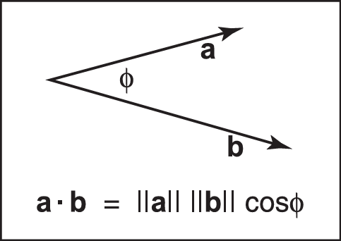

# 2.基础数学知识

图形学的大部分内容只是将数学公式直译成代码。数学公式越干净，写出的代码就越干净，所以本书的大部分内容都聚焦于“如何使用正确的数学公式完成工作”这个话题。本章回顾了高中和大学数学中的各种工具，旨在作为参考，而不是作为一个教程。本章可能看起来像是一个各种主题组成的大杂烩，事实上它也确实如此：每个主题之所以被选择是因为它在“标准”数学课程中的略微不寻常、因为它在图形学中具有核心地位、或者因为我们一般不从几何角处理它。除了对本书所使用的符号进行回顾外，本章还强调了标准本科课程中有时会跳过的几个要点，比如三角形的重心坐标。本章不会严肃探究这些知识，相反，我们会着重于直觉和几何解释。而对线性代数的讨论则被推迟到了第六章中我们学习矩阵变换之前。我们鼓励读者浏览本章以熟悉所涉及的主题，并在需要时参考本章。本章末尾的练习也许能帮助你确定哪些主题需要复习。

## 2.1 集合和映射

映射（mapping），也叫函数（function），是数学和编程的基础。像程序中的函数一样，数学中的映射接受某个类型（type）的参数，并将其映射到（返回）一个特定类型的对象。在程序中，我们说的是“类型”；在数学中，我们说的是“集合”。当一个对象是一个集合的成员时，我们使用 ∈ 符号。比如说，

$$
a\in S
$$

可以读作“ $a$ 是集合 $S$ 的成员”。给定任何两个集合 $A$ 和 $B $ ，我们可以通过取两个集合的笛卡尔积（cartesian product）来创建第三个集合，表示为 $A\times B$。这个集合 $A\times B$ 由所有可能的有序对 $(a,b)$ 组成，其中 $a\in B$ 且 $b\in B$。作为缩写，我们用符号 $A^2$表示 $A\times A$。我们可以扩展笛卡尔积，从三个集合中创建一个新集合，该集合包含所有可能的有序三元组，以此类推，从任意多的集合中创建任意长的有序元组。

常见的集合包括：

* $\mathbb{R}$——实数；
* $\mathbb{R^+}$——非负实数（包括0）；
* $\mathbb{R^2}$——真实二维平面中的有序对；
* $\mathbb{R^n}$——n维笛卡尔空间中的点；
* $\mathbb{Z}$——整数；
* $S^2$——单位球面上的三维点（R3 中的点）的集合。

请注意，虽然 $S^2$ 是由三维空间中的点组成的，但它也在一个可以用两个变量进行参数化的表面上，所以它可以被认为是一个二维集合。映射的记号使用箭头和冒号，例如：

$$
f:\mathbb{R}\mapsto \mathbb{Z},
$$

你可以把它理解为“有一个叫做 $f$ 的函数，它将一个实数作为输入，并将其映射成一个整数”。这里，箭头前面的集合被称为函数的定义域（domain），右边的集合被称为目标（target）。

> 译注：此处的目标（target）指的是陪域（codomain）。关于这点的详细讨论请参考https://math.stackexchange.com/questions/440235/range-of-function-vs-target-of-function 中的回答。

计算机程序员可能更愿意使用下面的等价表达：“有一个叫 $f$ 的函数，它有一个实数参数并返回一个整数”。换句话说，上面的集合映射符号等同于常见的编程符号：

$$
integer f(real) \leftarrow 等价 \rightarrow f:\mathbb{R} \mapsto \mathbb{Z}
$$

因此，“冒号-箭头”符号可以被认为是一种编程语法，就这么简单。

点 $f(a)$ 被称为 $a$ 的像（image），一个集合 $A$（定义域的子集）的像是目标的子集，目标包含 $A$ 中所有点的像。整个定义域的像被称为函数的值域（range）。

### 2.1.1 逆映射

如果我们有一个函数 $f:A\mapsto B$，那么可能存在一个反函数（inverse function）$f^{-1}:B\mapsto A$，这是通过 $f^{-1}(b)=a,b=f(a)$ 定义的。该定义只在所有 $b \in B$是函数 $f$ 下一些点的像（也就是说，值域和目标相等）且只有一个这样的点（也就是说，在 $f(a)=b$ 中，只有一个让等式成立的 $a$）的情况下有效。这种映射或函数称为双射（bijection）。双射将每一个 $a\in A$ 映射到唯一的 $b\in B$ ，对于每一个 $b\in B$ ，正好有一个 $a\in A$ ，使 $f(a)=b$ 

​​

**图 2.1**：一 个 双 射 $f$ 及其 反函数 $f^{-1}$。注 意，$f^{-1}$ 也 是 一个双 射。

例如，一组骑手和一组马匹之间的双射关系表明，每个人都骑着一匹马，每匹马都被骑着。这两个函数是骑手（马）和马（骑手），它们都是彼此的反函数。不是双射的函数没有反函数。

​​

**图 2.2**：函 数 $g$ 不具有反函 数，因为集合 $d$ 中的两个元素映射到了集合 $E$ 中的同一个元素。函数 $h$ 没有反函数，因为集合 $d$ 中没有元素映射到集合 $F$ 中的元素 $T$。

一个双射的例子是$f:\mathbb{R}\mapsto\mathbb{R},f(x)=x^3$。它的反函数为$f^{-1}(x) =3\sqrt{x}$。这个例子表明，标准的符号可能有些笨拙，因为 $x$ 在 $f$ 和 $f^{-1}$ 中都被用作虚拟变量（dummy variable）。有时使用不同的虚拟变量会更直观，比如写成 $y = f(x)$ 和 $x = f^{-1}(y)$ 的形式。这就有了更直观的 $y=x^3$ 和 $x=\sqrt[3]{y}$。一个没有反函数的例子是 $sqr:\mathbb{R}\mapsto\mathbb{R}, sqr(x) = x^2$。它没有反函数的原因有两个：首先：$x^2 = (−x)^2$，其次定义域中没有成员映射到目标的负数部分。请注意，如果我们把定义域和值域限制在 $\mathbb{R}^+$，还是可以定义一个反函数的。如此一来 $\sqrt{x}$ 就是一个有效的反函数。

### 2.1.2 区间

通常情况下，我们希望让一个函数处理的实数局限在某个范围内，实现这种约束的一个 方法就是规定一个区间（interval）。区间的一个例子是“0 和 1 之间的实数、不包括 0 或 1”，我 们把它表示为 $(0,1)$。因为它不包括其端点，所以被称为开区间。相对应的闭区间则包含其端 点，用方括号表示：$[0,1]$。这种符号可以混合使用；比如，$[0,1)$ 包括 0，但不包括 1。当写一 个区间 $[a,b]$ 时，我们假定 $a≤b$。表示一个区间的三种常见方法如**图2.3**所示。区间的笛卡尔积经常被使用。例如，为了表示点$x$在三维的单位立方体中，我们说$x\in[0,1]^3$。

​​

**图2.3**：三种等价的方式来表示 $a$ 到 $b$ 的左开右闭区间。

区间在与常常与集合运算结合在一起使用：交集（intersection）、并集（union）和差集 （difference）。例如，两个区间的交集是它们公共点的集合，符号 $\bigcap$ 用来表示交集。例如，$[3,5)\bigcap[4,6]=[4,5)$。而并集使用符号∪来表示两个区间中的点合并后产生的集合。例如，$[3,5)\bigcup[4,6]= [3, 6]$。差集运算符与前两个运算符不同，它根据参数顺序产生不同结果。减号用于差集运算， 它返回在左侧区间但不在右侧区间的点。例如，$[3,5)−[4,6]=[3,4]$，以及$[4,6]−[3,5]=[5,6]$。 这些操作用区间图就能很直观地表现出来。

​​

**图 2.4**：在 $[3, 5)$ 和 $[4,6]$ 上的区 间 操 作。

### 2.1.3 对数函数

尽管今天对数（logarithm）已不像使用计算器之前那么普遍了，但它在具有指数项的方程 问题中仍然很有用。根据定义，每个对数都有一个基数 $a$（$base$ $a$，也称“底”）。$x$ 的以 $a$ 为底 的对数通常被写作 $\log_{a}{x}$，并且它被定义为若要得到 $x$ 需要将 $a$ 乘幂的指数值。即：

$$
y =\log_{a}{x} \Leftrightarrow a^y=x.
$$

请注意，以a为底数的对数函数和以a为底数的幂函数是互逆的。这个基本定义可引申出几 个结论：

$$
a^{\log_{a}(x)} = x;\\ \log_{a}{(a^x)} = x;\\ \log_{a}{(xy)} = \log_{a}{x} + \log_{a}{y};\\ \log_{a}{(x/y)} = \log_{a}{x} − \log_{a}{y};\\ \log_{a}{x} = \log_{a}{b}\log_{b}{x}.
$$

当我们将微积分应用于对数时，经常会出现特殊数字$e=2.718...$。以$e$为底的对数被称为自然对数（naturallogarithm）。我们一般用简写 $ln$ 来表示：

$$
\ln_{x} ≡ \log_{e}{x}.
$$

“≡”符号的意思是“根据定义恒等”。像 $π$ 一样，特殊数字 $e$ 在很多情况下都会出现。除了 $e$ 以 外，在许多领域还使用特定的基数进行操作，并在其写法中省略基数，即 $\log{x}$ 的形式。例如， 天文学家经常使用以 10 为底的对数，理论计算机科学家经常使用以 2 为底的对数。由于计算机图形学借鉴了许多其他领域的技术，我们将避免这种缩写。对数的导数和指数的导数阐明了为什么自然对数是“自然的”：

$$
\frac{d}{dx} \log_{a}{x} = \frac{1}{x\ln_{a}};\\
\frac{d}{dx} a^x = a^x\ln_{}{a}.
$$

上面的常数乘数只有在 $a=e$ 时才等于 1。

## 2.2 求解二次方程

一个二次方程（quadraticequation）满足如下格式：

$$
Ax^2+Bx+C=0,
$$

其中 $x$ 是一个未知的实数，而 $A、B$ 和 $C$ 是已知的常数。如果你能联想到 $y=Ax^2+Bx+C$ 的二维 $xy$ 图，那么该二次方程的解就是函数 $y$ 与 $x$ 轴交点的横坐标值。因为 $y=Ax^2+Bx+C$ 是一条抛物线，根据抛物线是否未相交、相切或相交于 $x$ 轴，将有零个、一个或两个实数解。

​​

**图 2.5**：二次方程根的几何解释是抛物线与 $x$ 轴的 交点。

为了求解二次方程，我们先将方程除以 $A$：

$$
x^2 + \frac{B}{A} x + \frac{C}{A} =0.
$$

 然后，我们通过“构造平方项”的方式来合并项：

$$
(x+\frac{B}{2A})^2 − \frac{B^2}{4A^2} + \frac{C}{A} = 0.
$$

将常数部分移到等号右边，然后取平方根，得到：

$$
x + \frac{B}{2A} = \pm \sqrt{\frac{B^2}{4A^2} − \frac{C}{A}}.
$$

从两边减去 $\frac{B}{2A}$，然后用分母 $2A$ 合并分式，就得到了我们熟悉的形式：

$$
x = \frac{−B \pm \sqrt{B^2 − 4AC}} {2A}.
$$

此处的“$\pm$”符号意味着有两个解，一个是正号，一个是负号。因此，$3\pm1$ 等于 2 或 4。请注意，决定实数解数量的项是：

$$
D≡B^2−4AC,
$$

这被称为二次方程的判别式（discriminant）。如果 $D > 0$，有两个实数解（也叫根（root））；如果 $D=0$，有一个实数解（一个双根（a "double" root））；如果 $D<0$ 则没有实数解。

例如，$2x^2+6x+4=0$ 的根是 $x=−1$ 和 $x=−2$，方程 $x^2+x+1=0$ 没有实数解。这些方程的判别式分别是 $D=4$ 和 $D=−3$，且我们都按预期得到了解的数量。在程序中，我们通常先评估 $D$ 值，如果 $D$ 为负数，则直接返回无根（noroots）而不取平方根。

## 2.3 三角函数

在图形学中，我们在许多情况下都会用到基本三角函数。一般来说它平平无奇，但能记住基础定义往往是有帮助的。

### 2.3.1 角

尽管我们认为角的概念是理所当然的，但我们应重温其定义，以便我们将角的概念扩展到球体上。角是在两条射线（从一个原点出发的无限射线）或方向之间形成的，如图 2.6 所示，两条射线会形成两个角，我们还需要通过一些约定来决定使用哪个角。角（angle）是由射线在单位圆上切出的弧段的长度来定义的。一个常见的约定是使用较小的弧长，而角的符号由两条射线被指定的顺序决定。在该约定的约束下，所有角都在 $[−\pi, \pi]$ 范围内。

​​

**图 2.6**：两条射线将单位圆分为两个弧。任一弧的长度是两条射线之间的一个有效角度。我们要么使用较短的弧长作为角度，要么按照特定的顺序指定两条射线，且确定角度$\varphi$的弧是从第一条射线逆时针转到第二条射线的那部分弧。

这两个角中的任何一个都可以通过两条射线“切割”的单位圆的弧长来度量。因为单位圆的周长是 $2\pi$，所以两个可能的角总和为 $2\pi$，这种弧长的单位是弧度（radians）。另一个常见的单位是角度（degrees），圆的周角是 $360^{\circ}$。因此，一个弧度为 $\pi$ 的角的角度是 $180^{\circ}$，通常表示为 $180^{\circ}$。角度和弧度之间的转换是：

$$
\displaystyle
角度=\frac{180}{\pi}弧度；\\
$$

$$
弧度=\frac{\pi}{180}角度，
$$

### 2.3.2 三角函数

给出一个边长为 a、o、h 的直角三角形，其中 h 是最长边的长度（总是与直角相对），或者叫斜边（hypotenuse），勾股定理（Pythagorean theorem）描述了一种重要的关系：

$$
a^2 + o^2 = h^2.
$$

你可以从图 2.7 中看到这一点，大正方形的面积为 $(a + o)^2$，四个三角形的面积合计为 $2ao$，中心正方形的面积为 $h^2$。

​​

由于三角形和中心正方形均匀地细分了较大的正方形，所以我们可以很容易地取得如下公式：$2ao + h^2 = (a + o)^2$。通过直角三角形，我们可以定义角 $\phi$ 的 $\sin$ 值和 $\cos$ 值，以及其他基于比值的三角表达式：

$$
\sin{\phi} ≡\frac{o}{h};\\
$$

$$
\csc{\phi} ≡\frac{h}{o};
$$

$$
\cos{\phi} ≡\frac{a}{h};
$$

$$
\sec{\phi} ≡\frac{h}{a};
$$

$$
\tan{\phi} ≡\frac{o}{a};
$$

$$
\cot{\phi} ≡\frac{a}{o}.
$$

这些定义允许我们建立极坐标系（polar coordinates），其中任何一个点都被编码为其与原点的距离及其与 $x$ 轴正半轴的角（带符号），如 **图 2.8** 所示。

​​

**图 2.8**：点 $(x_a, y_a)=(1,\sqrt{3})$ 的极坐标 为 $(r_a,\phi_a)=(2,π/3)$。

请注意，角的范围是 $\phi \in (−\pi, \pi]$，且正数角是从 $x$ 轴正半轴逆时针方向旋转取得的。“将逆时针方向映射到一个正数”这个约定是主观性的，但它被应用于图形学很多场景中，因此值得一记。

三角函数是周期性的，可以接受任何角作为参数。例如，$\sin{A} = \sin{(A + 2π)}$。这意味着当我们考虑整个 $R$ 域时，这些函数是不可逆的。这个问题可以通过限制标准反函数的值域来避免。这在几乎所有现代数学库中都是以标准方式进行的（例如，Plauger（1991））。定义域和值域如下：

$$
a\sin : [−1, 1] \mapsto [-\frac{\pi}2,\frac{\pi}{2}];
$$

$$
a\cos : [−1, 1] \mapsto [0, \pi];
$$

$$
a\tan : \mathbb{R} \mapsto [−π2,π2];
$$

$$
a\tan 2 : \mathbb{R}^2 \mapsto [−π, π].
$$

最后一个函数 $a\tan 2(s, c)$ 往往很有用。它采用与 $sin {A}$ 成比例的值 $s$ 以及与 $\cos{A}$  成比例的值 $c$，两者具有相同的因子，最后返回值 $A$（假定因子为正数）。一种思考方式是它返回了二维笛卡尔点 $(c, s)$ 在极坐标中的角 **（图 2.9）** 。

​​

**图 2.9**：函 数$a\tan 2(s, c)$返回 A的角，这在图形学中往往很有用。

### 2.3.3 有用的恒等式

本节未经推导地列出了各种有用的三角恒等式。  
移位恒等式（shifting identities）：

$$
\sin{(−A)} = − \sin{A}
$$

$$
\cos{(−A)} = \cos{A}
$$

$$
\tan{(−A)} = − \tan{A}
$$

$$
\sin(\frac{\pi}{2}−A) = \cos{A}
$$

$$
\cos(\frac{\pi}{2}− A) = \sin{A}
$$

$$
\tan(\frac{\pi}{2}− A) = \cot{A}
$$

毕达哥拉斯恒等式（Pythagorean identities）：

$$
\sin^2{A} + \cos^2{A} = 1\\
\sec^2{A} − \tan^2{A} = 1\\
\csc^2{A} − \cot^2{A} = 1
$$

加减法恒等式（addition and subtraction identities）：

$$
\sin{(A + B)} = \sin {A} \cos {B} + \sin {B} \cos {A}\\
\sin{(A − B)} = \sin {A} \cos {B} − \sin {B} \cos {A}\\
\sin{(2A)} = 2 \sin {A} \cos {A}\\
\cos{(A + B)} = \cos {A} \cos {B} − \sin {A} \sin {B}\\
\cos{(A − B)} = \cos {A} \cos {B} + \sin {A} \sin {B}\\
\cos{(2A)} = \cos^2{A} − \sin^2{A}\\
$$

$$
\tan{(A + B)} = \frac{\tan {A} + \tan {B}} {1 − \tan{A} \tan{B}}
$$

$$
\tan{(A - B)} = \frac{\tan {A} - \tan {B}} {1 + \tan{A} \tan{B}}
$$

$$
\tan{(2A)} = \frac{2tan{A}} {1 - \tan^2{A}}
$$

半角恒等式（half-angle identities）：

$$
\sin^2{(\frac{A}{2})} = 1 − \cos{A^2}
$$

$$
\cos^2{(\frac{A}{2})} = 1 + \cos{A^2}
$$

乘法恒等式（product identities）：

$$
\sin{A} \sin{B} = -\frac{\cos{(A + B)} − \cos{(A − B)}}{2}
$$

$$
\sin {A} \cos {B} = \frac{\sin{(A + B)} + sin{(A − B)}}{2}
$$

$$
\cos {A} \cos {B} = \frac{\cos{(A + B)} + \cos{(A − B)}}{2}
$$

以下恒等式适用于边长为 $a$、$b$ 和 $c$ 的任意三角形，每边相对的角分别为 $A$、$B$、$C$​ **（图2.10）** ，

$$
\sin {A} a = \sin {B} b = \sin {C} c （正弦定理）
$$

$$
c^2 = a^2 + b^2 − 2ab \cos {C}（余弦定律）
$$

$$
\frac{a + b}{a − b} = \frac{\tan{\frac{A-B}{2}}}{\tan{\frac{A-B}{2}}}（正切定理）
$$

三角形的面积也可以根据这些边长计算：  

$$
三角形面积 = \frac{1}{4}\sqrt{p(a + b + c)(−a + b + c)(a − b + c)(a + b − c)}
$$

​​

**图2.10**：三角定律的几何示意图。

### 2.3.4 立体角和球面三角学

本节中的传统三角学涉及平面上的三角形。三角形也可以定义在非平面上，这在很多领域都会出现，比如天文学中就有定义在单位半径球体上的三角形。这些球面三角形（sphericaltriangles）的边是球面上的大圆（单位半径的圆）的线段。对这类三角形的研究是一个称为球面三角学（spherical trigonometry）的领域，其在图形学中一般并不常用，但当它出现时便不可忽视。我们不会在这里讨论它的细节，但希望读者知道当相关问题出现时存在这样一个研  
究领域，并且该领域有很多有用的规则，例如球面余弦定律和球面正弦定律。关于使用球面三角学机制的一个例子，请看一篇关于三角形光照采样（sampling triangle lights）（投影到一个球面三角形）的论文（Arvo，1995b）。

对计算机图形学而言，立体角（solid angles）的概念更加重要。角可以让我们量化一些东西，比如“在我的视野中这两根柱子的距离是多少”，而立体角则能让我们量化“那架飞机在我的视野中覆盖了多少面积”这样的问题。对于传统的角，我们把线段投射到单位圆上，并在单位圆上测量投射的两点之间的弧长。我们经常使用这个弧长作为角，以至于许多人都会忘记这个定义，因为在当下它对我们来说是如此直观。立体角也同样简单，但它们可能看起来更令人困惑，因为我们大多数人都是在成年后才了解它们的。对于立体角，我们把“看到”飞机的可见方向投射到单位球体上，并测量其面积。这个面积就是立体角，与“弧长就是角”的方式相同。角以弧度测量，总和为 $2\pi$（单位圆的总长度），而立体角则以立体弧度（steradians）测量，总和为 $4\pi$（单位球的总表面积）。

## 2.4 向量

向量（vector）同时描述了长度和方向，它总是用箭头表示。如果两个向量具有相同的长度和方向，则它们是相等的，即使在我们看来它们处于不同的位置 **（图 2.11）** 。

​​

**图 2.11**：这两个向量是相同的，因为他们拥有相同的长度和方向。

您应该尽可能地将向量视为箭头，而不是坐标或者数字。尽管有时在程序中我们不得不将向量表示为数字，但即使在代码中，他们也应该以对象的形式来操作，并且只有低级向量操作才能知道他们的数字表示（DeRose，1989）。向量用粗体字符表示，例如 $a$。向量的长度表示为 $\Vert a\Vert$。单位向量（unit vector）是长度为一的向量。零向量（zero vector）是零长度的向量，零向量的方向未定义。

向量可以用来表示许多不同的东西。例如，它们可用来存储偏移量（offset），或者叫位移（displacement）。如果我们知道“宝藏埋在秘密会议地点以东两步，以北三步”，那么我们就可以知道偏移量，但我们不知道起点在哪。向量也可以用来存储一个位置（location），或者说用来表达位置（position）或点（point）。一个位置可以表示为另一个位置的位移。通常我们有一个已知的原点位置，所有其他位置都存储为相对于它的偏移量。请注意，位置不是向量。正如我们将讨论的那样，您可以将两个向量相加。但将两个位置相加通常没有意义，除非它是计算某个位置加权平均值的中间操作（Goldman，1985 年）。将两个偏移量相加则确实有意义，所以这就是偏移量是向量的原因之一。这再次强调了位置本身不是偏移量，它是来自特定原点的偏移量，偏移量本身也不是位置。

### 2.4.1 向量运算

实数的算术运算向量基本也有。两个向量相等当且仅当它们具有相同的长度和方向。根据平行四边形法则（parallelogram rule）将两个向量相加。这条规则表明，两个向量的和是通过将任一向量的尾部放在另一个向量的头部来求得的 **（图 2.12）** 。

​​

**图2.12**：两个向量通过头尾相连来实现 相加，相加的顺序是任意的。

和向量是与两个向量共同“构成三角形”的向量。平行四边形是通过两个向量的任意求和顺序构成的。这表明向量加法具有可交换性：

$$
a + b = b + a.
$$

请注意，平行四边形法则只是形式化了我们对位移的直观感受。想象沿着一个向量从头走到尾，然后沿着另一个向量走。净位移只是平行四边形的对角线。您还可以为向量添加一元负号（unary minus）：$−a$​ **（图 2.13）** 是一个与 $a$ 长度相同但方向相反的向量。这样我们就能定义向量的减法：

$$
b − a ≡ −a + b.
$$

​​

**图2.13**：向 量 $−a$ 拥有与向量 $a$ 相同的长度但是方向相反。

您可以使用平行四边形法则可视化向量减法 **（图 2.14）** 。我们也可以将向量减法写成这种形式：

$$
a + (b − a) = b.
$$

​​

**图2.14**：向量减法只是第二个参数反转的矢量加法。

向量也可以相乘，事实上向量乘法不止一种。首先我们可以通过对向量乘以实数 $k$ 来缩放（scale）向量，这种乘法只改变向量的长度而不改变其方向。例如，$3.5a$ 是与 $a$ 方向相同的向量，但它的长度是 $a$ 的 3.5 倍。我们会在本节后面讨论涉及到两个向量的两种乘积，点乘（dot product）和叉乘（cross product），以及第 6 章中涉及到三个向量的乘积（行列式，determinant）。

### 2.4.2 向量的笛卡尔坐标系

一个二维向量可以由任意两个不平行的非零向量构造而来，这两个向量的性质叫做线性独立（linear independence）。两个线性独立的向量构成了一个二维基（或称“基底”，basis），相关向量也因此被称作基向量（basis vectors）。比如一个向量 $c$ 可以表示成两个基向量 $a$ 和 $b$ 的组合形式 **（图 2.15）** ：

$$
c = \text{a}_ca + \text{b}_cb.
$$

​​

**图2.15**：任意二维向量 $c$ 都是任意两个不平行二维向量 $a$ 和 $b$ 的加权和。

注意权重 $\text{a}_c$ 和 $\text{b}_c$ 是独一无二的。在这两个向量是正交（orthogonal）的情况下基特别有用（也就是说这两个向量构成了一个直角）；如果它们还是单位向量的话就更有用了，这时它们是标准正交的（orthonormal）。如果我们假设这样两个特殊的向量 $x$ 和 $y$ 是已知的，那我们就能用它们表示笛卡尔坐标系（Cartesian coordinate system）中的所有其他向量了，每个向量都可以用两个实数来表示。比如一个向量 $a$ 可以表示成：

$$
a = \text{x}_ax + \text{y}_ay,
$$

其中 $\text{x}_a$ 和 $\text{y}_a$ 是二维向量 $a$ 的实数笛卡尔坐标 **（图 2.16）** 。

​​

**图2.16**：向量的二维笛卡尔基。

注意这和前一个公式并没有什么本质区别，尽管前一个公式中的基向量不是标准正交的。而使用笛卡尔坐标系会有一些好处，例如，根据勾股定理，$a$ 的长度是：

$$
\Vert a \Vert = \sqrt{x_a^2 + y_a^2}
$$

在笛卡尔坐标系中计算点乘、叉乘、向量坐标也很简单，这点我们在接下来的章节里就会看到。按照惯例，我们在写向量 $a$ 的坐标时可以写成有序数对 $(x_a, y_a)$ 的形式，也可以写成列矩阵（column matrix）的形式：

$$
a = \left[ \begin{array}{c}
x_a \\ 
y_b
\end{array} \right].
$$

矩阵的形式取决于排版惯例，我们偶尔也会将其写成行矩阵（row matrix）的形式，这时我们会用 $a^T$ 的形式：

$$
a^T =
\left[
\begin{array}{cc}
x_a & y_a
\end{array}
\right].
$$

我们也可以用这种方法描述笛卡尔坐标系中三维或更高维的向量。对于三维向量，我们会额外使用一个同时与向量 $x$、向量 $y$ 正交的基向量 $z$。

### 2.4.3 点乘

点乘（dot product）是将两个向量相乘的最简单途径。向量 $a$ 和向量 $b$ 的点乘记为 $a \cdot b$，由于其返回的结果是个标量，它也因此被称为标量乘法（scalar product）。点乘返回的结果取决于两个向量的长度和它们之间的夹角 $\Phi$​ **（图 2.17）** ：

$$
a \cdot b = \Vert a \Vert \Vert b \Vert \cos{\Phi},
$$

在图形学程序中，点乘最常见的用途便是计算两向量间夹角的余弦值了。

​​

**图2.17**：点乘与长度和角相关，它是图形学中最重要的公式之一。

除此以外点乘还可以计算一个向量在另一个向量上的投影值。向量 $a$ 在向量 $b$ 上的投影 $a \rightarrow b$ 是以直角投射上去的 **（图 2.18）** ：

$$
a \rightarrow b = \Vert a \Vert \cos{\Phi} =
\frac{a \cdot b} {\Vert b \Vert} ,
$$

​​

**图2.18**：向 量 a 在向量 b 上的投影是根据上述公式推导出来的。

点乘也遵循实数计算中常见的结合律和分配律：

$$
a \cdot b = b \cdot a,\\
a \cdot (b + c) = a \cdot b + a \cdot c,\\
(ka) \cdot b = a \cdot (kb) = ka \cdot b.
$$

如果二维向量 $a$ 和 $b$ 以笛卡尔坐标的形式表示，我们可以利用 $x \cdot x = y \cdot y = 1$ 和 $x \cdot y = 0$ 这两个公式来推导出如下点乘公式：

$$
a · b = (\text{x}_ax + \text{y}_ay) \cdot (\text{x}_bx + \text{y}_by)\\
= \text{x}_a\text{x}_b(x \cdot x) + \text{x}_a\text{y}_b(x \cdot y) + \text{x}_b\text{y}_a(y \cdot x) + \text{y}_a\text{y}_b(y \cdot y)\\
= \text{x}_a\text{x}_b + \text{y}_a\text{y}_b.
$$

同理对于三维向量可得：

$$
a \cdot b = \text{x}_a\text{x}_b + \text{y}_a\text{y}_b + \text{z}_a\text{z}_b.
$$

### 2.4.4 叉乘

叉乘 $a \times b$ 往往只用于三维向量，本章末尾笔记中的参考文献对广义叉乘（generalized cross products）进行了讨论。叉乘返回一个与其两个乘数垂直的三维向量，结果向量的长度与$\sin {\Phi}$. 相关：

$$
\Vert a \Vert \times \Vert b \Vert = \Vert a \Vert \Vert b \Vert \sin {\Phi}.
$$

$\Vert a \times b \Vert$ 的数值等于向量 $a$ 和向量 $b$ 构成的平行四边形的面积大小。此外，$a \times b$ 同时与向量 $a$ 和向量 $b$ 垂直 **（图 2.19）** 。

​​

**图 2.19**：叉 乘 $a \times b$的结果是一个同时与向量 $a$ 和向量 $b$ 垂直的三维向量，且 $a \times b$ 的长度等于上图所示平行四边形的面积。

注意这样一个向量有两种可能的方向。根据定义，$x−$ 轴、$y−$ 轴、$z−$ 轴的方向向量被定义为：

$$
x = (1, 0, 0),\\
y = (0, 1, 0),\\
z = (0, 0, 1),
$$

然后我们约定如下：$x \times y$ 的方向必须在 $z−$ 轴正半轴方向或负半轴方向。具体方向选择是随意的，但如下公式是确定的：

$$
z = x \times y.
$$

三个笛卡尔单位向量的所有可能的排列如下所示：

$$
x \times y = +z,\\
y \times x = −z,\\
y \times z = +x,\\
z \times y = −x,\\
z \times x = +y,\\
x \times z = −y.
$$

由于 $\sin {\Phi}$ 的特性，我们也可以知道一个向量自身的叉乘是零向量，例如：$x \times x = 0$。注意叉乘不满足交换律，也就是说 $x \times y \neq y \times x$。细心的读者可能会发现以上讨论无法让我们清晰描绘出三个笛卡尔轴之间的关系。更确切地说，如果我们把 $x$ 轴和 $y$ 轴放在人行道上并让 $x$ 轴指向东边、$y$ 轴指向北边，那么 $z$ 轴会指向天空还是地面呢？一般我们会使用名为“右手坐标系”的系统，其名称来源于以右手为参考的记忆体系：用右手手掌和手指“抓住”$x$ 轴、然后朝 $y$ 轴的方向旋转，向量 $z$ 应该会沿着大拇指方向（如 **图 2.20** 所示）。

> 译注：这几句话原文如下：“This name comes from the memory scheme of ”grabbing” x with your right palm and fingersand rotating it toward y. The vector z should align with your thumb.”。此处表达非常晦涩难懂且图片完全无法展示右手动作，建议此处按照国内老师对于右手坐标系的讲解进行学习，或参考维基百科（笛卡尔坐标系 # 三维空间）上的图片。

​​

**图2.20**：叉乘的“右手定则”。试想一下将右掌根放在向量 **a** 和向量 **b** 的尾部交叉处、然后将向量 **a** 的箭头推向向量 **b**，你右手拇指所指方向就是 $a \times b$ 的方向。

叉乘遵循结合律和分配律：

$$
a \times (b + c) = a \times b + a \times c,\\
a \times (kb) = k(a \times b).
$$

但根据“右手定则”，叉乘不满足交换律：

$$
a \times b = −(b \times a).
$$

如果用笛卡尔坐标表示向量，我们可以用一个清晰明确的展开式来计算叉乘：

$$
a \times b = (\text{x}_ax + \text{y}_ay + \text{z}_az) \times (\text{x}_bx + \text{y}_by + \text{z}_bz)\\
= \text{x}_a\text{x}_bx \times x + \text{x}_a\text{y}_bx \times y + \text{x}_a\text{z}_bx \times z \\+ \text{y}_a\text{x}_by \times x + \text{y}_a\text{y}_by \times y + \text{y}_a\text{z}_by \times z\\ + \text{z}_a\text{x}_bz \times x + \text{z}_a\text{y}_bz \times y + \text{z}_a\text{z}_bz \times z\\
= (\text{y}_a\text{z}_b − \text{z}_a\text{y}_b)x + (\text{z}_a\text{x}_b − \text{x}_a\text{z}_b)y + (\text{x}_a\text{y}_b − \text{y}_a\text{x}_b)z.
$$

‍

进一步可得坐标公式如下：

$$
a \times b = (\text{y}_a\text{z}_b − \text{z}_a\text{y}_b, \text{z}_a\text{x}_b − \text{x}_a\text{z}_b, \text{x}_a\text{y}_b − \text{y}_a\text{x}_b).
$$

### 2.4.5 标准正交基和坐标框架

管理坐标系是几乎所有图形程序的核心任务之一，这项任务的关键是管理标准正交基（orthonormal bases）。任意两个正交（互相垂直）且长度均为单位 1 的二维向量 $u$ 和 $v$ 的集合都能构成一个标准正交基，也就是说：

$$
\Vert u \Vert = \Vert v \Vert = 1,\\
u \cdot v = 0.
$$

在三维空间中，满足以下两个条件的三个向量 $u$、$v$、$w$ 共同构成标准正交基：

$$
\Vert u \Vert = \Vert v \Vert = \Vert w \Vert = 1,\\
u \cdot v = v \cdot w = w \cdot u = 0.
$$

如果以下公式成立，则该标准正交基是右旋的（right-handed）, 否则是左旋的（left-handed）：

$$
w = u \cdot v,
$$

注意笛卡尔规范标准正交基（Cartesian canonical orthonormal basis）只是无数可能标准正交基中的一种，真正让它与众不同的是它和它的隐式原点位置在程序中用作底层表示。因此，向量 $x$、$y$、$z$ 从不显式存储，也不会规定规范原点位置 $o$。全局模型往往存储在这个规范坐标系中，它也因此常被称为全局坐标系（global coordinate system）。但如果我们想使用另一个使用原点 $p$ 和正交基 $u$、$v$、$w$ 的坐标系就必须显式存储这些向量。这样一个坐标系被称为参考系（frame of reference）或坐标系（coordinate frame）。比如在一个飞行模拟器中，我们可能想要储存一个原点在飞机机鼻处、标准正交基与飞机方向一致的坐标系；同时我们还需要一个主要的规范坐标系 **（图 2.21）** 。和一个特定物体（比如飞机）绑定的坐标系，往往被称为局部坐标系（local coordinate system）。

底层上，局部坐标系是以规范坐标形式存储的。例如，如果 $u$ 有坐标$(x_u，y_u，z_u)$,

$$
u = \text{x}_ux + \text{y}_uy + \text{z}_uz.
$$

位置隐式包含与标准原点的偏移：

$$
p = o + \text{x}_px + \text{y}_py + \text{z}_pz,
$$

其中$(x_p, y_p, z_p)$是 $p$ 点的坐标。

注意，如果我们存储一个关于 $u-v-w$ 坐标系的向量 $a$，我们实际上是存储一个三元组$(u_a，v_a，w_a)$，其几何解释为：

$$
a = \text{u}_au + \text{v}_av + \text{w}_aw.
$$

要获得存储在$u-v-w$坐标系中的向量$a$的标准坐标，只需记得 $u$、$v$ 和 $w$ 本身是以笛卡尔坐标存储的，因此表达式$u_au+v_av+w_aw$已经是笛卡尔坐标。为了获得存储在标准坐标系中的向量 $b$ 的 $u-v-w$坐标，我们可以使用点积：

$$
\text{u}_b = u \cdot b;
\text{v}_b = v \cdot b;
\text{w}_b = w \cdot b.
$$

​​

**图2.21**

这是因为我们知道对于一些$u_b$ 、$v_b$和$w_b$  

$$
\text{u}_bu + \text{v}_bv + \text{w}_bw = b,
$$

点积分解$u_b$坐标：

$$
u \cdot b = \text{u}_b(u \cdot u) + \text{v}_b(u \cdot v) + \text{w}_b(u \cdot w)\\
= \text{u}_b.
$$

之所以如此，这是因为 $u$、$v$ 和 $w$ 是正交的。

第7.2.1节和第7.5节将讨论使用矩阵实现坐标系的变化。

### 2.4.6 从单个向量构造基

通常我们需要一个与给定向量对齐的正交基。也就是说，给定一个向量 $a$，我们需要一组正交的 $u$，$v$ 和 $w$，使得 $w$ 指向 $a$ 的同一方向（Hughes&Moller，1999），但我们并不特别关心 $u$ 和 $v$ 是什么。一个向量不足以确定唯一的答案；我们需要一个强大的方法，可以找到任何一个可能的基。

这可以像下面这样使用叉积来完成。首先使 $w$ 成为 $a$ 方向上的单位向量：

$$
w = \frac{a}{\Vert a \Vert}.
$$

然后选择任意一个与 $w$ 不共线的向量 $t$，并使用叉积构建垂直于 $w$ 的单位向量 $u$：

$$
u=\frac{t\times w}{||t\times w||}.
$$

 如果 $t$ 与 $w$ 共线，分母将消失，如果它们几乎共线，结果的精度将很低。找到与 $w$ 完全不同的向量的一个简单步骤是，从 $t$ 等于 $w$ 开始，并将 $t$ 的最小幅值分量改为 1。例如，如果$w=(1/\sqrt{2},-1/\sqrt{2},0)$，那么$t=(1/\sqrt{2},-1/\sqrt{2},1)$。一旦w和u被确定了，完成这组基就很简单了：  

$$
v = w \times u.
$$

使用此形式的情形的一个示例是曲面投影，其中需要与曲面法线对齐的基，但围绕法线的旋转通常不重要。

> 这样的方法当然可以用来构建任意顺序的三个向量，只是需要注意点乘的顺序确保基符合右手法则。

对于正式的生产代码，皮克斯的研究人员最近开发了一种从两个向量构建新向量的方法，这种方法以其紧凑性和高效性而令人印象深刻（Duff等人，2017）。他们提供了经过实战考验的代码，并鼓励读者使用，因为在整个行业中使用时并未出现任何“错误”。

### 2.4.7 从两个向量构造基

当基围绕给定向量旋转比较重要时，上一节中的程序也可用。一个常见的例子是为摄影机建立基：让一个向量与摄影机的观察方向对齐很重要，但摄影机围绕该向量的方向不是任意的，需要以某种方式指定。一旦固定了方向，就完全确定了基。

完全指定坐标系的常用方法是通过提供两个向量 $a$（指定 $w$）和 $b$（指定 $v$）。如果已知两个向量垂直，则通过 $u=b\times a$ 构造第三个向量就很简单了。

> $u =a\times b$ 也产生了一个标准正交基，但它是一个左手系。

为了确保，即使输入向量不完全是正交的，生成的基也是正交的，建议使用与单向量过程类似的过程：

‍

$$
w=\frac{a}{||a||}
$$

$$
u=\frac{b\times w}{||b\times w||}
$$

$$
v=w\times u
$$

> 如果你想让我将向量 $w$和 $v$ 设置为两个非垂直的方向，那么必须有所妥协——按照这个方案，我会按你的要求设置所有的东西，但是我只会对 $v$ 做最小的改动，使其实际上与向量 $w$ 垂直。

事实上，当 $a$ 和 $b$ 不垂直时，这个方法也能很好的奏效。在这种情况下，$w$ 将精确地沿 $a$ 的方向构造，并且 $v$ 被选择为垂直于 $w$ 的所有向量中与 $b$最近的向量。

如果 $a$ 和 $b$ 是共线的，此过程将不起作用。在这种情况下，$b$对于选择垂直于a的方向是没有帮助：因为它垂直于所有可能的方向。

在指定摄像机位置的示例（第4.3节）中，我们希望构造一个坐标系，该坐标系的 $w$ 与摄像机的观察方向平行，$v$ 应指向摄像机的顶部。为了使相机垂直定向，我们围绕视图方向建立基，使用垂直向上方向作为参考向量来确定相机围绕视图方向的朝向。将 $v$ 设置为尽可能接近垂直，与“将相机保持垂直”的直观概念完全匹配。

#### 2.4.8 正交化基

有时，您可能会在计算种发现一些问题，这些问题是由假定为正交的基引起的，但由于计算中的舍入误差，或由于基存储在文件中的精度较低，因此出现了错误。

这时我们可以使用上一节的程序；简单地使用现有的 $w$ 和 $v$ 向量重新构造产生一个新的正交基，并且与旧的基接近。

这种方法适用于许多应用程序，但不是最好的。它确实产生精确的正交向量，并且对于几乎正交的原始基，结果不会偏离起始点太远。然而，它是不对称的：它“偏爱”$w$ 胜过 $v$，“偏爱”$v$ 胜过 $u$（其起始值被丢弃）。它选择一个接近原始基的基，但不能保证选择的是最接近的正交基。当这不能够满足需求时，可以使用SVD（第5.4.1节）计算正交基，该正交基保证最接近原始基。

‍

‍
